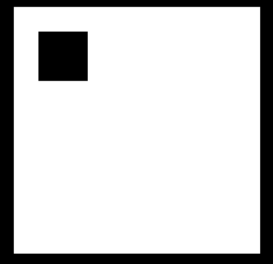
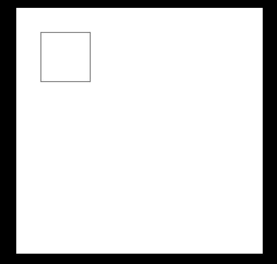
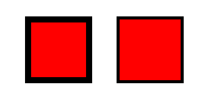
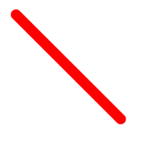
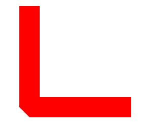
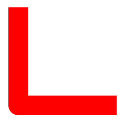

#canvas笔记 -- 基础1
------
##1-canvas简介
要时刻记住，已经绘制的就无法修改了；

###1.1-描述
HTML5 `<canvas>` 标签用于通过脚本(通常是 JavaScript)绘制图像
不过，`<canvas>` 元素本身并没有绘制能力（相当于画布）而 脚本相当于画笔。

浏览器支持
Internet Explorer 9、Firefox、Opera、Chrome 以及 Safari 支持 canvas 及其属性和方法。
注释：Internet Explorer 8 以及更早的版本不支持 canvas 元素。

###1.2-性质
- canvas 具有默认尺寸：width：300px height：150px;
- 当浏览器不支持canvas标签的时候，就会将canvas标签里的内容显示出来`<canvas>当浏览器不兼容canvas标签的时候会显示这里的内容</canvas>`

注：
1. canvas 的宽高只能写在其自定义属性中，如果写在style中，会将画布等比缩放，而不是设置大小；
2. canvas 距离窗口有一段默认距离


##2-canvas绘图

canvas只能通过脚本进行绘图

例如：JavaScript

首先获取元素
`var oC = document.getElementsByTagName('canvas')[0]`
然后设置绘图模式
`var oCG = document.getContext('2d')`

>注：1.getContext() 方法可返回一个对象，通过对象提供的方法和属性在画布上绘图。
2.目前只支持2d --- wegGL支持3d;


###2.1-canvas的基础属性：

fillStyle || strokeStyle || lineWidth

>注：
1. lineWidth无需单位；
2. 必须在绘制前设置,就像是在画布上的绘制后，就不能更改；

1) fillStyle

简介：
    填充样式；默认值：#000
语法：
    `oCG.fillStyle=color || gradient || pattern;`
参数：
    - color 指示绘图填充色的 CSS 颜色值。
    - gradient 用于填充绘图的渐变对象（线性或放射性）
    - pattern 用于填充绘图的 pattern 对象

(待补充)

2) strokeStyle

简介：
    描边样式，默认1px solid #000;
语法：
    `oCG.fillStyle=color || gradient || pattern;`
参数：
    - color 指示笔触的 CSS 颜色值。
    - gradient 用于填充绘图的渐变对象（线性或放射性）
    - pattern 用于创建 pattern 笔触的 pattern 对象

(待补充)

3) lineWidth

简介：
    描边的宽度
语法：
    `oCG.lineWidth=number;`
参数：
    number：宽度数值(无需单位)，以像素计；


##3-基础绘图

###3.1-方形形绘制(这是唯一两种能直接绘制的方法)

fillRect() || strokeRect()

####3.1.1 - 方法一：rect()

介绍：
    绘制一个矩形(无边框，无填充色)，必须声明绘图模式使用；
语法：
    `oCG.rect(x,y,width,height);`
参数：
    - x 矩形左上角的 x 坐标
    - y 矩形左上角的 y 坐标
    - width 矩形的宽度，以像素计
    - height 矩形的高度，以像素计：
实例：

```
        var oC = document.getElementsByTagName('canvas')[0];
        var oCG = oC.getContext('2d');

        oCG.fillStyle = 'red';
        oCG.lineWidth = 10;
        oCG.strokeStyle = 'blur';

        oCG.rect(50,50,100,100);
        oCG.fill();
        oCG.stroke();
```


####3.1.2-方法二：fillRect() 填充方块

介绍：
    绘制一个已填充的方块,默认填充黑色
语法：
    `oCG.fillRect(x,y,width,height);`
参数：
    - x 矩形左上角的 x 坐标
    - y 矩形左上角的 y 坐标
    - width 矩形的宽度，以像素计
    - height 矩形的高度，以像素计
实例：

```
        var oC = document.getElementsByTagName('canvas')[0];
        var oCG = oC.getContext('2d');
        oCG.fillRect(50,50,100,100)
```



####3.1.3-方法三：strokeRect() 描边方块

介绍：
    strokeRect() 方法绘制矩形（不填色）。笔触的默认颜色是黑色,描边的默认是1px solid black。

语法：
     `oCG.strockRect(x,y,width,height);`
参数：
    - x 矩形左上角的 x 坐标
    - y 矩形左上角的 y 坐标
    - width 矩形的宽度，以像素计
    - height 矩形的高度，以像素计

实例：

```
    var oC = document.getElementsByTagName('canvas')[0];
    var oCG = oC.getContext('2d');
    oCG.strokeRect(50,50,100,100)
```



>注：虽然描边的默认是 1px solid black; 但是实际中是从中间向两侧扩散0.5px 来实现的，然后由电脑将0.5px补充成1px，这样实际就会显示成2px；这样如果有必要就需要在定位的时候在位置上为其补上0.5px。例：`strokeRect( 55.5 55.5 100 100)`


>注：如果在一个图形中同时设置fillRect 和 strokeRect 的设置顺序很重要，后面的会覆盖
如下图，左侧是先填充后描边， 右侧相反；




##4-绘图模式：

fill() || stroke()

因为，已经绘制的就无法更改，所以，要合理选择位置；
例如，如果先闭合再绘制stroke()，绘制出来的就是一个闭合图形，如果先绘制stroke()再闭合，闭合的时候就无法绘制闭合的那一条线；

###4.1 - 方法一：fill()

简介：
    填充绘制区域，如果绘制区域没有闭合就填充成一条线 有疑问？会闭合
语法：
    `oCG.fill()`


###4.2 - 方法二：stroke()

简介：
    绘制区域描边，如果绘制区域没有闭合就是一条直线
语法：
    `oCG.stroke()`


##5-路径

beginPath || moveTo || closePath || lineTo || clip || quadraticCurveTo || bezierCurveTo || arc || arcTo || isPointInPath

- beginPath() 起始一条路径，或重置当前路径
- moveTo() 把路径移动到画布中的指定点，不创建线条，一个begin-close中可以有多个起点；
- lineTo() 添加一个新点，然后在画布中创建从该点到最后指定点的线条
- closePath() 创建从当前点回到起始点的路径(闭合)
- clip() 从原始画布剪切任意形状和尺寸的区域
- quadraticCurveTo() 创建二次贝塞尔曲线
- bezierCurveTo() 创建三次方贝塞尔曲线
- arc() 创建弧/曲线（用于创建圆形或部分圆）
- arcTo() 创建两切线之间的弧/曲线
- isPointInPath() 如果指定的点位于当前路径中，则返回 true，否则返回 false


其中常用的有：fill() || stroke() || beginPath || moveTo || closePath || lineTo


##6-线条样式

lineCap || lineJoin || lineWidth || miterLimit

- lineCap 设置或返回线条的结束端点样式
- lineJoin 设置或返回两条线相交时，所创建的拐角类型
- lineWidth 设置或返回当前的线条宽度
- miterLimit 设置或返回最大斜接长度 (待补充)


###6.1-方法一：lineCap

简介：
    lineCap 属性设置或返回线条末端的样式。
语法：
    `context.lineCap="butt|round|square";`
参数：
    - butt 默认。向线条的每个末端添加平直的边缘。
    - round 向线条的每个末端添加圆形线帽。
    - square 向线条的每个末端添加正方形线帽。

实例：
```
        oCG.beginPath();
        oCG.strokeStyle = 'red';
        oCG.moveTo(100,100);
        oCG.lineTo(300,300);
        oCG.lineWidth = 20;
        oCG.lineCap = 'round';
        oCG.stroke();
        oCG.closePath();
```
round：


>注：square是在线条两侧继续添加线条宽度一般的长度

###6.2-方法二：lineJoin

简介：
    lineJoin 设置两条线条交汇处的样式；
语法：
    `context.lineJoin="bevel|round|miter";`
参数：
    - bevel 创建斜角。
    - round 创建圆角。
    - miter 默认。创建尖角。
实例：
bevel：

round：


##7-其它

###7.1-clearRect(); -- 清除

简介：
   clearRect() 方法清空给定矩形内的指定像素。
语法：
    context.clearRect(x,y,width,height);
参数：
    - x 要清除的矩形左上角的 x 坐标
    - y 要清除的矩形左上角的 y 坐标
    - width 要清除的矩形的宽度，以像素计
    - height 要清除的矩形的高度，以像素计

实例：
清除画布所有内容：
`oCG.clearRect(0,0,oC.width,oC.height)`

###7.2-save() || restore()

```
    save() 保存当前环境的状态,写在要保存状态后面,只能保存一次
    restore() 返回之前保存过的路径状态和属性,写在要使用保存状态的路径前
```

个人理解：
save() 和 restore()之间相当于形成了一个局部域。内部样式( fillStyle || strokeStyle || lineWidth )不会影响后面的样式，为了不影响上面的样式，就要闭合选区。


案例：
1. 鼠标绘图
<a href="案例1-鼠标划线.html" target="_blank">鼠标划线</a>
2. 移动方块
<a href="案例2-方块移动.html" target="_blank">移动方块</a>
