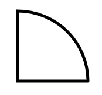

#canvas笔记 -- 基础2
------
注意事项：任何时候绘图顺序很重要

一般以此为结构进行测试

```
<!DOCTYPE html>
<html lang="en">
<head>
  <meta charset="UTF-8">
  <title>Document</title>
  <style>
    body {
      background: #58a;
    }
    canvas {
      position: absolute;
      top: 50%; left: 50%;
      margin-top: -250px;
      margin-left: -250px;
      background: #fff;
    }
  </style>
</head>
<body>
  <canvas id="canvas" width="500" height="500"></canvas>
  <script>
    var c = document.getElementById('canvas');
    var ctx = c.getContext('2d');
    /*
    在下面添加内容
     */
  </script>
</body>
</html>
```

#1. 绘图

##1.1 绘制圆 -- 方法：arc() n.弧（度）；弧光（全称electric arc）；弧形物；天穹

简介：
    方法创建弧/曲线（用于创建圆或部分圆）。
语法：
    c.arc(x,y,r,sAngle,eAngle,counterclockwise);
参数：
- x 圆的中心的 x 坐标。
- y 圆的中心的 y 坐标。
- r 圆的半径。
- sAngle 起始角，以弧度计。（弧的圆形的三点钟位置是 0 度）。
- eAngle 结束角，以弧度计。
- counterclockwise 可选。规定应该逆时针还是顺时针绘图。False = 顺时针，true = 逆时针。

>注：
1. 弧度 = 角度*Math.PI/180
2. 角度可以接受负数

实例：
```
    var c = document.getElementById('canvas');
    var ctx = c.getContext('2d');
    ctx.beginPath();
    ctx.arc(100, 100, 50, 0*Math.PI/180, -90*Math.PI/180)
    ctx.stroke();
    ctx.closePath()
```


<a href="canvas2/arc.html" target="_blank">arc实例1</a>


实例：小时钟

注意事项：

1)绘制指针的原理：
其实角度和结束角度相同，利用该方法可以绘制，任意斜角的直线
```
    var x = 250;
    var y = 250;
    var r = 200;

    ctx.beginPath();
    ctx.lineWidth = "5";
    ctx.moveTo(x, y);
    ctx.arc(x, y, r*0.6, -90*Math.PI / 180 , -90*Math.PI / 180);
    ctx.stroke();
```

2)绘制刻度的原理：
在绘制图像时，起点都是以moveTo的位置开始，中间不会断开。
```
    var x = 250;
    var y = 250;
    var r = 200;

    ctx.beginPath();
    ctx.lineWidth = "5";
    ctx.moveTo(x, y);
    ctx.arc(x, y, r*0.6, -90*Math.PI / 180 , -0*Math.PI / 180);
    ctx.stroke();
    ctx.closePath()
```


>注：
这里的ctx.stroke() 和 ctx.closePath()的位置不同绘制的图像不同，先ctx.stroke()的话，就是先描边，然后闭合，最后闭合的线条没有描边的效果；先ctx.closePath()则是先闭合再描边，所有的线条都会有描边的效果；(可以自己试一试)

先描边：

先闭合：


DOME：
<a href="canvas2/arc实例--绘制时钟.html" target="_blank">绘制时钟</a>


##1.2 曲线的绘制

简介：
    绘制两条切线之间的弧线；
语法：
    `context.fillRect(x1,y1,x2,y2,r)`
参数：
    - x1 弧的起点的 x 坐标
    - y1 弧的起点的 y 坐标
    - x2 弧的终点的 x 坐标
    - y2 弧的终点的 y 坐标
    - r 弧的半径

>注：
以上一次的路径的尾部为起始端点，如果没有就以moveTo的位置作为起始端点然后将起始端点与坐标点1之间构成直线（即切线一）,然后以第一个坐标与第二个坐标的连接线为第二条切线，在这两条线中间,以r为半径绘制一个分别与两条切线相切的弧线；

可参考：
<a href="canvas2/arcTo.html" target="_blank">参考</a>


##1.2.1 两种贝塞尔曲线绘制方法；


1）quadraticCurveTo ()

简介：
    绘制一条二次贝塞尔曲线；

语法：

    `context.quadraticCurveTo(cpx,cpy,x,y);`

参数
    - cpx 贝塞尔控制点的 x 坐标
    - cpy 贝塞尔控制点的 y 坐标
    - x 结束点的 x 坐标
    - y 结束点的 y 坐标


绘制贝塞尔曲线需要三个点，一由 路径的结束位置(如果结束为止不存在就以 beginPath 或者 moveTo 设置的点)确定的起始点，二是贝塞尔控制点，以及一个结束点；


<a href="canvas2/贝塞尔曲线1.html" target="_blank">动图参考</a>
其中移动的是控制点1;

>注：感觉就是起始位置和结束位置的连线，受到控制点的吸引形成；

2）bezierCurveTo()

简介：
    绘制二次贝塞尔曲线

语法：
    `context.bezierCurveTo(cp1x,cp1y,cp2x,cp2y,x,y);`

参数：
    - cp1x 第一个贝塞尔控制点的 x 坐标
    - cp1y 第一个贝塞尔控制点的 y 坐标
    - cp2x 第二个贝塞尔控制点的 x 坐标
    - cp2y 第二个贝塞尔控制点的 y 坐标
    - x 结束点的 x 坐标
    - y 结束点的 y 坐标

基本与一次一致，只是多了个控制点


<a href="canvas2/贝塞尔曲线2.html" target="_blank">动图参考</a>


#2-canvas的变换

1）translate -- 偏移

简介：
    translate() 方法重新映射**画布上的** (0,0) 位置。在后面的绘制的将以新的值作为起点；


语法：
    `context.translate(x,y);`

参数：
    - x 添加到水平坐标（x）上的值
    - y 添加到垂直坐标（y）上的值

实例：
```
    function draw () {

            ctx.clearRect(0, 0, c.width, c.height);
            ctx.save();
            ctx.beginPath();

            ctx.fillRect(0, 100, 100, 100);

            num ++;
            ctx.translate(num, num)
            ctx.fillRect(0, 100, 100, 100);

            ctx.closePath();
            ctx.restore();
        }
```


<a href="canvas2/translate.html" target="_blank">动图参考</a>

>注：这里的translate改变的仅是画布的 0,0 点的位置，只会影响后面的绘图路径；

2）rotate -- 旋转

简介：
    rotate() 方法旋转当前的绘图。旋转中心在canvas的左上角；

语法：
    `context.rotate(angle);`

参数：
    angle 旋转角度，以弧度计。


实例：
```
    function draw () {

            ctx.clearRect(0, 0, c.width, c.height);

            ctx.save();
            ctx.beginPath();

            num ++;
            num1+=10;

            ctx.fillStyle = 'red';
            /* 将画布的0,0点移动到旋转中心位置，为了设置旋转角度 */
            ctx.translate(50, 50);
            ctx.rotate(num1*Math.PI/180);

            /* 将画布的0，0点移动原来的位置，为了下面的旋转图形的绘制 */
            ctx.translate(-50, -50);

            ctx.fillRect(0, 0, 100, 100);

            ctx.closePath();
            ctx.restore();
        }
```

<a href="canvas2/rotate.html" target="_blank">动图参考</a>

>注：
1. 如需将角度转换为弧度，请使用 degrees*Math.PI/180 公式进行计算。
举例：如需旋转 5 度，可规定下面的公式：5*Math.PI/180。
2. 由于旋转中心在左上角，所以在旋转之前，要先将旋转中心移动到对应位置，但是translate同时又影响了下面的绘图，所以当将旋转中心移动到相应位置后，再将画布0,0移动到初始的位置。


3）scale -- 缩放

简介：
    scale() 方法缩放当前绘图，更大或更小。

>注释：如果您对绘图进行缩放，所有之后的绘图也会被缩放。定位也会被缩放。如果您 scale(2,2)，那么绘图将定位于距离画布左上角两倍远的位置。


语法：
    `context.scale(scalewidth,scaleheight);`

参数：
    - scalewidth 缩放当前绘图的宽度 (1=100%, 0.5=50%, 2=200%, 依次类推)
    - scaleheight 缩放当前绘图的高度 (1=100%, 0.5=50%, 2=200%, etc.)

这些canvas变换要注意使用顺序：
方法一：
1. 先通过translate 将画布的0，0移动到相应的位置（因为缩放以及旋转都是以0,0点为中心的）；
2. 然后进行缩放或者是旋转
3. 接着，讲画布的0,0点再通过translate移动到原来位置，
4. 进行绘图；

方法二：
当然如果能够计算绘图在画布的0,0点移动后的位置,在计算偏移值，也是没问题的；

<a href="canvas2/scale.html" target="_blank">动图参考</a>

