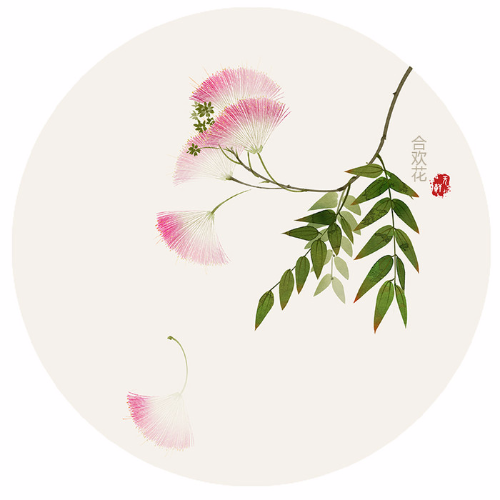
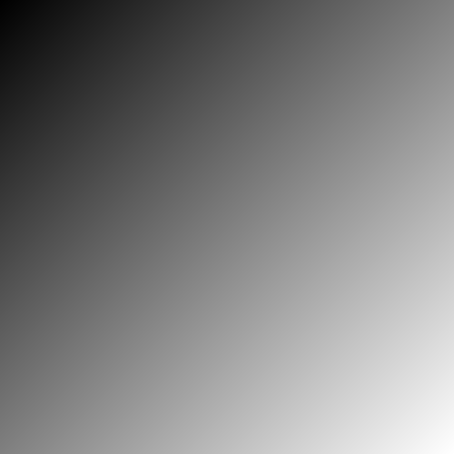
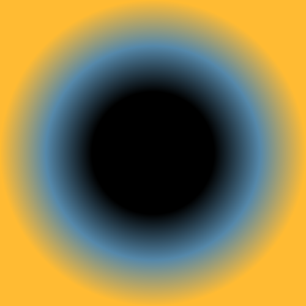
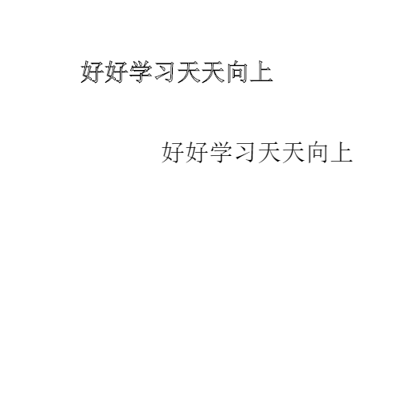
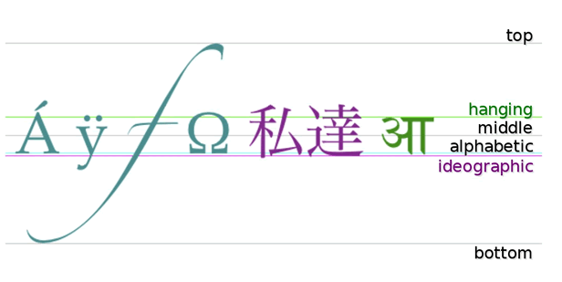
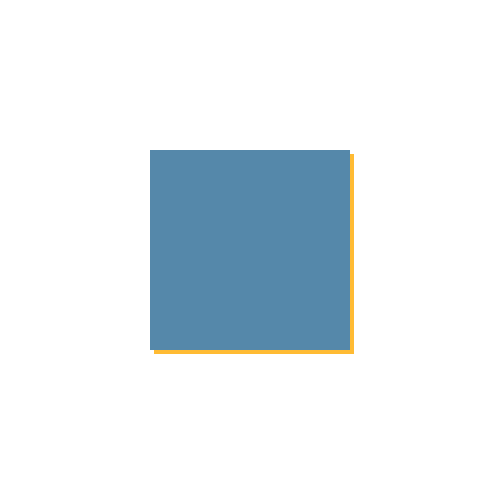
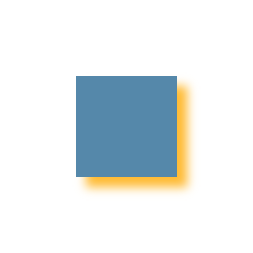

#canvas笔记 -- 基础2
------
注意事项：任何时候绘图顺序很重要

一般以此为结构进行测试

```html
<!DOCTYPE html>
<html lang="en">
<head>
  <meta charset="UTF-8">
  <title>Document</title>
  <style>
    body {
      background: #58a;
    }
    canvas {
      position: absolute;
      top: 50%; left: 50%;
      margin-top: -250px;
      margin-left: -250px;
      background: #fff;
    }
  </style>
</head>
<body>
  <canvas id="canvas" width="500" height="500"></canvas>
  <script>
    var c = document.getElementById('canvas');
    var ctx = c.getContext('2d');
    /*
    在下面添加内容
     */
  </script>
</body>
</html>
```

##1-canvas与图片


###1.1 drawImage()
注：必须等到图片加载完成后，再执行canvas的操作；

简介:
    drawImage() 方法在画布上绘制图像、画布或视频。
    drawImage() 方法也能够绘制图像的某些部分，以及/或者增加或减少图像的尺寸。

语法：
    `context.drawImage(img,sx,sy,swidth,sheight,x,y,width,height);`

参数：
    - img 规定要使用的图像、**画布**或**视频**。
    - sx 可选。开始剪切的 x 坐标位置。
    - sy 可选。开始剪切的 y 坐标位置。
    - swidth 可选。被剪切图像的宽度。
    - sheight 可选。被剪切图像的高度。
    - x 在画布上放置图像的 x 坐标位置。
    - y 在画布上放置图像的 y 坐标位置。
    - width 可选。要使用的图像的宽度。（伸展或缩小图像）
    - height 可选。要使用的图像的高度。（伸展或缩小图像）

实例：
1)基本
```
        var c = document.getElementById('myCanvas');
        var ctx = c.getContext('2d');
        var img = new Image();
        img.src = '3.jpg';
        img.onload = function () {
            draw();
        }
        function draw () {
            ctx.drawImage (img, 0, 0, 500, 500);
        }
```



<a href="drawImage.html" target="_blank">实例1</a>

2)剪裁：
```
    function draw () {
            ctx.drawImage(img,250,250,100,100, 0, 0, 500, 500);
        }
```

>注：
剪裁图片时，先将图片按照剪裁的尺寸进行裁剪，然后将裁剪后的图片，按照设置放在画布上来


<a href="drawImage.html" target="_blank">实例1</a>

3)视频(待补充)

向画布中引入视频中的当前帧，如果使用定时器来刷新画布，将会形成动画效果；
方法：将视频（video节点代替img）
具体内容待补充

效果可参考
http://www.w3school.com.cn/tags/canvas_drawimage.asp


###1.2 creatPattern() -- 设置背景
pattern
n. 模式；图案；样品
vt. 模仿；以图案装饰
vi. 形成图案

简介：
    createPattern() 方法在指定的方向内重复指定的元素。

>注：元素可以是图片、视频，或者其他 <canvas> 元素。
被重复的元素可用于绘制/填充矩形、圆形或线条等等。

语法：
`context.createPattern(image,"repeat|repeat-x|repeat-y|no-repeat")`

参数
    - image 规定要使用的图片、画布或视频元素。
    - repeat 默认。该模式在水平和垂直方向重复。
    - repeat-x 该模式只在水平方向重复。
    - repeat-y 该模式只在垂直方向重复。
    - no-repeat 该模式只显示一次（不重复）。

>注：
1. 通过createPattern得到的只是，一种填充的形式，需要通过fillStyle 或者 strokeStyle属性才能引入。
2. 填充的时候，起点为画布的0,0点；
3. 只有在路径的内部才会显露出来；

实例：
```
    /* 创建填充样式 */
    var bg = ctx1.createPattern(c[0],'repeat');
    /* 使用创建的样式 */
    ctx1.fillStyle = bg;
    /* 绘制路径 */
    ctx1.fillRect(0,0,c[1].width,c[1].height)
```
<a href="canvas3/creatPattern.html" target="_blank">实例1</a>

##2-canvas渐变

渐变都是作为画布的填充，以画布的0，0作为起点，而在闭合区域内部才会显示出来；

###2.1 - 线性渐变createLinearGradient()

介绍：
    createLinearGradient() 方法创建线性的渐变对象。渐变可用于填充矩形、圆形、线条、文本等等。

>注：
1. 通过createPattern得到的只是，一种填充的形式，需要通过fillStyle 或者 strokeStyle属性才能引入。
2. 请使用 addColorStop() 方法规定不同的颜色，以及在 gradient 对象中的何处定位颜色，可以插入多个渐变点，渐变点的范围0-1；


语法：
    `context.createLinearGradient(x0,y0,x1,y1);`

参数：
    - x0 渐变开始点的 x 坐标
    - y0 渐变开始点的 y 坐标
    - x1 渐变结束点的 x 坐标
    - y1 渐变结束点的 y 坐标


实例：
```
     function draw () {
            var cLG = ctx.createLinearGradient(0, 0, 500, 500);
            // addColorStop是添加在创建的渐变对象上的
            cLG.addColorStop(0,"black");
            cLG.addColorStop(1,"white");
            //通过fillStyle引入
            ctx.fillStyle = cLG;
            ctx.fillRect(0, 0, 500, 500);
        }
```

<a href="canvas3/creatLinearGradient.html" target="_blank">实例1</a>


<a href="canvas3/creatLinearGradient2.html" target="_blank">动态实例</a>


###2.2 - 放射性渐变createRadialGradient()

语法：
    `context.createRadialGradient(x0,y0,r0,x1,y1,r1);`

参数：
    - x0 渐变的开始圆的 x 坐标
    - y0 渐变的开始圆的 y 坐标
    - r0 开始圆的半径
    - x1 渐变的结束圆的 x 坐标
    - y1 渐变的结束圆的 y 坐标
    - r1 结束圆的半径


和线性渐变使用基本一致，需要注意的有，渐变是从第一个圆的边界开始到第二个圆的边界结束。

实例

<a href="canvas3/creatRadialGradient.html" target="_blank">动态实例</a>

##3-canvas 文本

###3.1 strokeText() 描边文字

简介
    strokeText() 方法在画布上绘制文本（没有填色）。文本的默认颜色是黑色。

> 注：
请使用 font 属性来定义字体和字号，并使用 strokeStyle 属性以另一种颜色/渐变来渲染文本。

语法：
    `context.strokeText(text,x,y,maxWidth)`

参数
    - text 规定在画布上输出的文本。
    - x 开始绘制文本的 x 坐标位置（相对于画布）。
    - y 开始绘制文本的 y 坐标位置（相对于画布）。
    - maxWidth 可选。允许的最大文本宽度，以像素计。

###3.2 fillText() 填充文字

和strokeText() 基本一致


###3.3 属性 font 文字样式

简介：
    font 属性设置或返回画布上文本内容的当前字体属性。
    font 属性使用的语法与 CSS font 属性相同。
    默认值： 10px sans-serif

语法：
    `context.font="italic small-caps bold 12px arial `

实例：
```
    function draw () {
            if (num >= 100 || num < 0) {
                speed = -speed;
            }
            num += speed;

            ctx.font = "30px Arial";

            ctx.strokeText(str, 100, 100, 300);

            ctx.fillText(str, 200, 200, 300);
        }
```


<a href="canvas3/strokeText.html" target="_blank">实例</a>


注：必须声明字体；

###3.3 文字样式

1）textAlign -- 属性文字对齐方式

介绍：
    textAlign 属性根据锚点，设置或返回文本内容的当前对齐方式。
    通常，文本会从指定位置开始，不过，如果您设置为 textAlign="right" 并将文本放置到位置 150，那么会在位置 150 结束。

>注：使用 fillText() 或 strokeText() 方法在实际地在画布上绘制并定位文本。

默认值： start

语法：
    `context.textAlign="center|end|left|right|start";`

属性值:
    - start 默认。文本在指定的位置开始。
    - end 文本在指定的位置结束。
    - center 文本的中心被放置在指定的位置。
    - left 文本左对齐。
    - right 文本右对齐。

<a href="canvas3/textAlign.html" target="_blank">动图实例</a>

2）textBaseline -- 属性 文字的垂直对齐方式;

简介：
    textBaseline 属性设置或返回在绘制文本时的当前文本基线。
    下面的图示演示了 textBaseline 属性支持的各种基线：



>注：fillText() 或 strokeText() 方法在画布上定位文本时，将使用指定的 textBaseline 值。
默认值： alphabetic

语法：
`context.textBaseline="alphabetic|top|hanging|middle|ideographic|bottom"`

属性值
    - alphabetic 默认。文本基线是普通的字母基线。
    - top 文本基线是 em 方框的顶端。。
    - hanging 文本基线是悬挂基线。
    - middle 文本基线是 em 方框的正中。
    - ideographic 文本基线是表意基线。
    - bottom 文本基线是 em 方框的底端。


<a href="canvas3/textBaseline.html" target="_blank">动图实例</a>
没看出什么区别，如果有就再来补充；

###3.4 文字样式 -- measureText() 测量文字尺寸时使用；

简介：
    measureText() 方法返回包含一个对象，该对象包含以像素计的指定字体宽度。
    如果您需要在文本向画布__输出之前__，就了解文本的宽度，那么请使用该方法。

语法
    `context.measureText(text).width`

参数
    text 要测量的文本。

注：
    1. 要写在绘制文本之前；
    2. 这个方法只有width属性，没有height，但是字高就等于了height


##4-canvas阴影

shadowOffsetX || shadowOffsetY || shadowColor || shadowBlur

###4.1- shadowOffsetX || shadowOffsetY -- 属性

简介：
    shadowOffsetX 属性设置或返回__形状与阴影__的水平距离。
    shadowOffsetX=0 指示阴影位于形状的正下方。
    shadowOffsetX=20 指示阴影位于形状 left 位置右侧的 20 像素处。
    shadowOffsetX=-20 指示阴影位于形状 left 位置左侧的 20 像素处。
    默认值： 0

语法：
    `context.shadowOffsetX=number`

属性值
    number 正值或负值，定义阴影与形状的水平距离。


<a href="canvas3/shadowOffset.html" target="_blank">动图实例</a>


###4.2 shadowColor -- 属性

简介：
    shadowColor 属性设置或返回用于阴影的颜色。
>注：
1. 请将 shadowColor 属性与 shadowBlur 属性一起使用，来创建阴影。
2. 请通过使用 shadowOffsetX 和 shadowOffsetY 属性来调节阴影效果。
3. 默认值： #000000

语法：
    `context.shadowColor=color`

属性值
    color 用于阴影的 CSS 颜色值。默认值是 #000000。

### 4.3 shadowBlur -- 属性

简介：
    shadowBlur 属性设置或返回阴影的模糊级数，计算方式：高斯模糊。
    默认值：0

语法：
    `context.shadowBlur=number`

属性值
    number 阴影的模糊级数

<a href="canvas3/shadow.html" target="_blank">动图实例</a>


注：shadow 属性同样适用于文字
<a href="canvas3/textShadow.html" target="_blank">动图实例</a>
