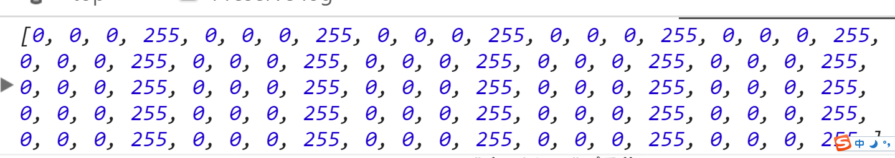
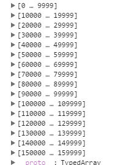
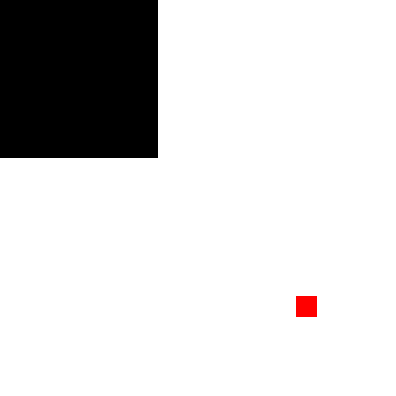
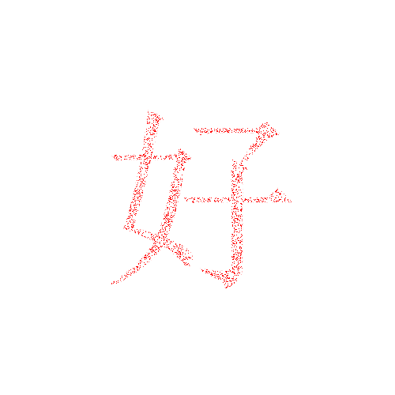
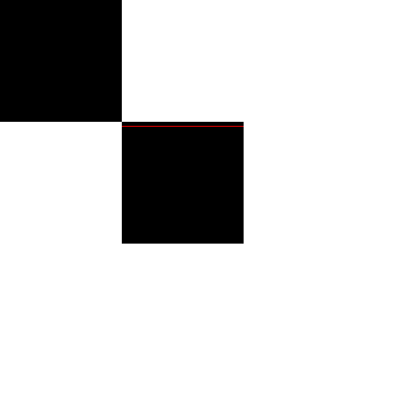
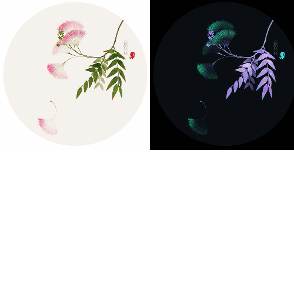
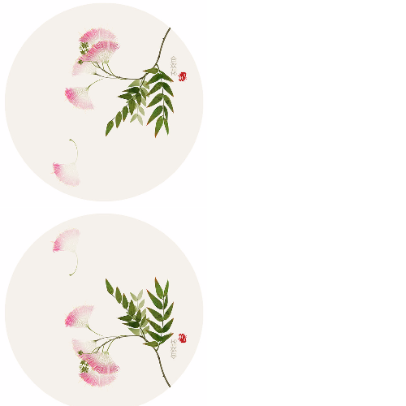
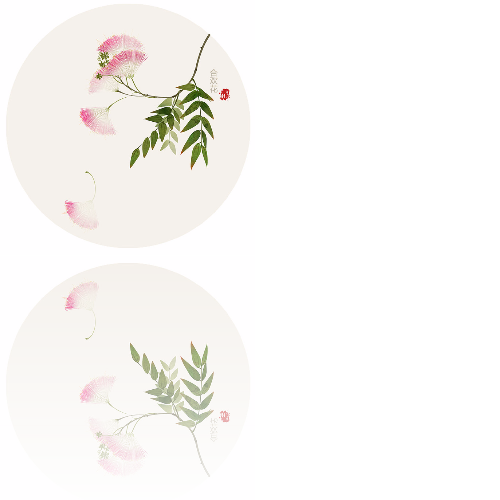
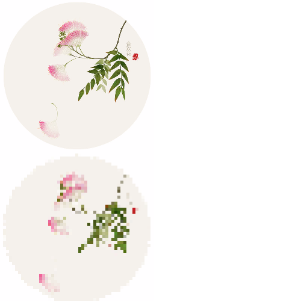

#canvas 笔记4

##1-canvas像素

###1.1 getImageData() -- 方法

__简介：__
    获取画布上某一区域的img信息；
    getImageData() 方法返回 ImageData 对象，该对象拷贝了画布指定矩形的像素数据。
    对于 ImageData 对象中的每个像素，都存在着四方面的信息，即 RGBA 值：
    - R - 红色 (0-255)
    - G - 绿色 (0-255)
    - B - 蓝色 (0-255)
    - A - alpha 通道 (0-255; 0 是透明的，255 是完全可见的)
    color/alpha 以数组形式存在，并存储于__ ImageData 对象的 data 属性中。__

>注：在操作完成数组中的 color/alpha 信息之后，您可以使用 putImageData() 方法将图像数据拷贝回画布上。

__语法：__
`var imgData=context.getImageData(x,y,width,height)`

__参数：__
    - x 开始复制的左上角位置的 x 坐标。
    - y 开始复制的左上角位置的 y 坐标。
    - width 将要复制的矩形区域的宽度。
    - height 将要复制的矩形区域的高度。

__实例：__
获取画布一块的数据
```
        (function () {
            var c = document.getElementById('canvas');
            var ctx = c.getContext('2d');
            ctx.beginPath();
            ctx.save();

            ctx.fillRect(0, 0, 200, 200);

            var img = ctx.getImageData(0, 0, 200, 200);
            console.log(img.data)

            ctx.restore();
            ctx.closePath();
        })()
```

imageData 中的 data属性：

imageData 中的 imageData对象：


<a href="canvas4/canvas像素.html" target="_blank"> 获取图片信息 </a>


>注
1. 在 ImageData 对象的 data 属性中，每四个值代表着一个像素，值得注意的是在这里透明度的取值也同样是0-255的范围内；
2. 在一个100px*100px的方块中，共有10000个像素点，每个像素点4个值，那就有40000个像素数据储存在data属性中，通过循环data属性中的每一项来操作每一个像素的每一个数值，如果仅是操作像素就循环imageData对象，或者循环100px*100px;
3. imgData 中由3个属性：1.data 2.width(获取图像区域的宽度) 3.height(获取图像区域的高度)


###1.2 putImageData() -- 方法

__简介：__
    putImageData() 方法将图像数据（从指定的 ImageData 对象）放回画布上。

__语法：__
`context.putImageData(imgData,x,y,dirtyX,dirtyY,dirtyWidth,dirtyHeight)`

__参数：__
    - imgData 规定要放回画布的** ImageData 对象**。
    - x ImageData 对象左上角的 x 坐标，以像素计。
    - y ImageData 对象左上角的 y 坐标，以像素计。
    - dirtyX 可选。水平值（x），以像素计，在画布上放置图像的位置。
    - dirtyY 可选。水平值（y），以像素计，在画布上放置图像的位置。
    - dirtyWidth 可选。在画布上绘制图像所使用的宽度。
    - dirtyHeight 可选。在画布上绘制图像所使用的高度。

注：后面四个参数要写都要写,dirtyX和dirtyY--个人理解：就是图像放上去以后从dirtyX 和 dirtyY处开始才会显示出来

```
    (function () {
            var c = document.getElementById('canvas');
            var ctx = c.getContext('2d');
            ctx.beginPath();
            ctx.save();

            ctx.fillRect(0, 0, 200, 200);

            var oImage = ctx.getImageData(0, 0, 200, 200);

            for (var i = oImage.data.length - 1; i >= 0; i--) {
                oImage.data[i*4] = 255;
            }

            ctx.putImageData(oImage, 200, 200);


            ctx.restore();
            ctx.closePath();
        })()
```

注：putImageData使用的是ImageData对象而不是对象下面的data属性；



<a href="canvas4/putImageData.html" target="_blank">实例1</a>
<a href="canvas4/putImageData1.html" target="_blank">改变dirty属性动态演示</a>


###1.3 createImageData() -- 方法

__简介：__
    createImageData() 方法创建新的空白 ImageData 对象。新对象的默认像素值 transparent black。

>注：
1. 以指定的尺寸（以像素计）创建新的 ImageData 对象：
var imgData=context.createImageData(width,height);
2. 创建与指定的另一个 ImageData 对象尺寸相同的新 ImageData 对象（不会复制图像数据）：

__语法：__
    `var imgData=context.createImageData(imageData)`
    `var imgData=context.createImageData(width,height)`

__参数：__
    - width ImageData 对象的宽度，以像素计。
    - height ImageData 对象的高度，以像素计。
    - imageData 另一个 ImageData 对象。


##像素实例：

实例一：

绘制像素文字：

思路：获取像素点个数，保留一部分，然后补全像素信息，最后储存在创建的imageData对象中，放在画布上

```
    function draw (con) {
                ctx.clearRect(0, 0, c.width, c.height);
                ctx.beginPath();
                ctx.save();

                /* 设置字高，以及字体属性(字体中，字体大小和字体样式是必须的)，*/

                var h = 250;
                ctx.font = 250 + 'px Arial';
                ctx.fillStyle = "red";

                /* 设置字体上下左右居中 */
                ctx.textAlign = "center";
                ctx.textBaseline = "middle";

                /* 获取文字宽度 */

                var m = ctx.measureText(con).width;
                ctx.fillText(con, 255, 255);
                var oImg = ctx.getImageData((c.width-m)/2, (c.height-m)/2, m, m);

                /* 关键：这里的使用arrRandom目的：通过m*h的到所有像素的个数，从所有的像素中，随机获取其中五分之一的像素位置 */

                var newArr = arrRandom(m*h, m*h/10);

                /*将画布中的文字清除，为创建的图片做准备*/

                ctx.clearRect(0, 0, c.width, c.height);

                /* 新的空白 ImageData 对象,用于存放像素信息 */

                var newPic = ctx.createImageData(m, h);

                /* 
                    关键：将随机获取的像素位置扩展成具有完整信息的数据 
                */

                for (var i = newArr.length - 1; i >= 0; i--) {
                    newPic.data[newArr[i] * 4] = oImg.data[newArr[i] * 4];
                    newPic.data[newArr[i] * 4+1] = oImg.data[newArr[i] * 4+1];
                    newPic.data[newArr[i] * 4+2] = oImg.data[newArr[i] * 4+2];
                    newPic.data[newArr[i] * 4+3] = oImg.data[newArr[i] * 4+3];
                }

                /* 将创建的imageData对象，放入画布 */

                ctx.putImageData(newPic, (c.width-m)/2, (c.height-m)/2);

                ctx.restore();
                ctx.closePath();
            }

            /* all -- 所有像素的个数 select要选取的像素个数 */
            function arrRandom (all, select) {
                var allArr = [];
                var newArr = [];
                /* 相当于将像素顺序记录 */
                for (var i = all-1; i >= 0; i--) {
                    allArr.push(i);
                };
                /* 随机保留选取的像素在总像素的位置 */
                for (var i = select; i >= 0; i--) {
                    newArr.push(allArr.splice(Math.floor(Math.random()*allArr.length), 1))
                }
                return newArr;
            }
```


<a href="canvas4/createImageData.html">像素文字</a>

注：由于循环量特别大，所以性能特别差；

实例二：

像素文字动画：

思路：将imageData分成相应份数，每份都保存一部分的随机数据，然后每次显示一份，最终完全显示出来；

```
    <script>
        (function () {
            var text = document.getElementsByTagName('li');
            var c = document.getElementById('canvas');
            var ctx = c.getContext('2d');
            var iNow = 0;
            var timer = null;

            for (var i = text.length - 1; i >= 0; i--) {
                text[i].onclick = function () {
                    draw(this.innerHTML);
                }
            }

            /* 绘图开始 */

            function draw (con) {
                clearInterval(timer);
                ctx.clearRect(0, 0, c.width, c.height);
                ctx.beginPath();
                ctx.save();

                /* 设置字高，以及字体属性(字体中，字体大小和字体样式是必须的)，*/

                var h = 250;
                ctx.font = 250 + 'px Arial';
                ctx.fillStyle = "red";

                /* 设置字体上下左右居中 */
                ctx.textAlign = "center";
                ctx.textBaseline = "middle";

                /* 获取文字宽度 */

                var m = ctx.measureText(con).width;
                ctx.fillText(con, 255, 255);
                var oImg = ctx.getImageData((c.width-m)/2, (c.height-m)/2, m, m);

                /* 关键：这里的使用arrRandom目的：通过m*h的到所有像素的个数，从所有的像素中，随机获取其中五分之一的像素位置 */

                var newArr = arrRandom(m*h, m*h/5);
                console.log(newArr)

                /*将画布中的文字清除，为创建的图片做准备*/

                ctx.clearRect(0, 0, c.width, c.height);

                /* 新的空白 ImageData 对象,用于存放像素信息 */

                var newPic = ctx.createImageData(m, h);

                /*
                    关键：将随机获取的像素位置扩展成具有完整信息的数据
                */

                /*
                    关键：每次循环一次定时器，就将newArr其中的一项显示出来，最终就实现了完整的显示；
                 */

                timer = setInterval(function () {

                    for (var i = newArr[iNow].length-1; i >= 0; i--) {
                        newPic.data[newArr[iNow][i] * 4] = oImg.data[newArr[iNow][i] * 4];
                        newPic.data[newArr[iNow][i] * 4+1] = oImg.data[newArr[iNow][i] * 4+1];
                        newPic.data[newArr[iNow][i] * 4+2] = oImg.data[newArr[iNow][i] * 4+2];
                        newPic.data[newArr[iNow][i] * 4+3] = oImg.data[newArr[iNow][i] * 4+3];
                    }
                    /* 将创建的imageData对象，放入画布 */

                    ctx.putImageData(newPic, (c.width-m)/2, (c.height-m)/2);

                    if(iNow == 4){
                        iNow = 0;
                        clearInterval(timer);
                    } else{
                        iNow++;
                    }

                }, 100)

                ctx.restore();
                ctx.closePath();
            }

            /* all -- 所有像素的个数 select要选取的像素个数 */
            function arrRandom (all, select) {
                var allArr = [];
                var arr = [];
                /* 相当于将像素顺序记录 */
                for (var i = all-1; i >= 0; i--) {
                    allArr.push(i);
                };
                /*
                关键，将all循环all/select遍，从而使allArr被截取all/select次，allArr被截取干净就意味着所有的像素信息都已经保存出来，然后每一次截取的当成数组中的一项，用于以后每次添加一项。
                 */
                for (var j = all/select; j >= 0; j--) {
                    var newArr = [];
                    for (var i = select; i >= 0; i--) {
                        /* 这里的splice也很关键，可以保证已经选过的不会被重复选中 */
                        newArr.push(allArr.splice(Math.floor(Math.random()*allArr.length), 1))
                    }
                    arr.push(newArr);
                }
                /* 随机保留选取的像素在总像素的位置 */
                return arr;
            }
        })()
    </script>
```


<a href="canvas4/createImageData1.html">像素文字动画</a>

注：由于循环量特别大，所以性能特别差；

实例三：
getPos setPos的封装

getPos -- 得到点的颜色信息；
setPos -- 设置点的颜色信息；

```
function getPos (obj, x, y) {
    var w = obj.width;
    var h = obj.height;
    var d = obj.data;

    var color = [];

    color[0] = d[4*(x+y*w)];
    color[1] = d[4*(x+y*w) + 1];
    color[2] = d[4*(x+y*w) + 2];
    color[3] = d[4*(x+y*w) + 3];

    return color;
}

function setPos (obj, x, y, color) {
    var w = obj.width;
    var h = obj.height;
    var d = obj.data;

    d[4*(y*w+x)] = color[0];
    d[4*(y*w+x)+1] = color[1];
    d[4*(y*w+x)+2] = color[2];
    d[4*(y*w+x)+3] = color[3];

}
```


<a href="canvas4/getPos-setPos.html" target="_blank">设置</a>

实例三：图片颜色翻转：

思路：使用255-图像的data中的（rgb）实现颜色的翻转，然后创建一个新的Image对象接收，最后将完成的新ImageData放回画布；必须在服务器的环境下运行；

```
    <script>
        var c = document.getElementById('canvas');
        var ctx = c.getContext('2d');
        var img = new Image();
        img.src = '3.jpg';
        img.onload = function () {
            draw()
        }

        function draw () {
            ctx.beginPath();
            ctx.save();

            ctx.drawImage(img, 0, 0, 255, 255)
            var newImg = ctx.getImageData(0, 0, 255, 255);
            // 创建了一个图片空的ImageData对象
            var newDa = ctx.createImageData(newImg);

            // 反色的就是用255-原来的色值，循环所有元素，然后扩展，最后赋值
            for (var i = 0; i < newImg.width*newImg.height; i++) {
                newDa.data[i*4] = 255 - newImg.data[i*4];
                newDa.data[i*4+1] = 255 - newImg.data[i*4+1];
                newDa.data[i*4+2] = 255 - newImg.data[i*4+2];
                newDa.data[i*4+3] = 255;
            }
            // 将创建好的ImageData 放到画布上；
            ctx.putImageData(newDa, 255, 0);

            ctx.restore();
            ctx.closePath();
        }
    </script>
```

当然也可以在原来的数据上修改

```
    for (var i = 0; i < newImg.width*newImg.height; i++) {
            newImg.data[i*4] = 255 - newImg.data[i*4];
            newImg.data[i*4+1] = 255 - newImg.data[i*4+1];
            newImg.data[i*4+2] = 255 - newImg.data[i*4+2];
            newImg.data[i*4+3] = 255;
        }
    ctx.putImageData(newImg, 255, 0);
```


<a href="canvas4/颜色翻转.html" target="_blank">颜色翻转</a>

实例四：图片翻转：

必须在服务器的环境下运行；

```
    <script>
        var c = document.getElementById('canvas');
        var ctx = c.getContext('2d');
        var img = new Image();
        img.src = '3.jpg';
        img.onload = function () {
            draw()
        }

        function draw () {
            ctx.beginPath();
            ctx.save();

            ctx.drawImage(img, 0, 0, 255, 255)
            var newImg = ctx.getImageData(0, 0, 255, 255);
            var newData = ctx.createImageData(newImg);

            var w = newImg.width;
            var h = newImg.height;

            // 关键：将数据以二维的数据形式循环，然后将纵向的信息对称调换
            for (var i = 0; i < h; i++) {
                for (var j = 0; j < w; j++) {
                    newData.data[((h-i)*w + j)*4] = newImg.data[(i*w + j)*4]
                    newData.data[((h-i)*w + j)*4+1] = newImg.data[(i*w + j)*4+1]
                    newData.data[((h-i)*w + j)*4+2] = newImg.data[(i*w + j)*4+2]
                    newData.data[((h-i)*w + j)*4+3] = newImg.data[(i*w + j)*4+3]
                }
            }
            console.log(newData)
            ctx.putImageData(newData, 0, 255);

            ctx.restore();
            ctx.closePath();
        }
    </script>
```


<a href="canvas4/图像翻转.html" target="_blank">图像翻转</a>

如果需要透明度也发生变化，只需继续修改透明度这一项

```
    //从上到下的变化
    newData.data[((h-i)*w + j)*4+3] = 255 - (h-i);
    //从下到上的变化
    newData.data[((h-i)*w + j)*4+3] = 255 - i;
    //从左到右的变化
    newData.data[((h-i)*w + j)*4+3] = 255 - j;
    //从右到左的变化
    newData.data[((h-i)*w + j)*4+3] = 255 - (w-j);
```



实例五：马赛克

必须在服务器环境下

```
    <script src = 'getPos-setPos.js'></script>
    <script>
        var c = document.getElementById('canvas');
        var ctx = c.getContext('2d');
        var img = new Image();
        img.src = '3.jpg';
        img.onload = function () {
            draw()
        }

        function draw () {
            ctx.beginPath();
            ctx.save();

            ctx.drawImage(img, 0, 0, 255, 255)
            var newImg = ctx.getImageData(0, 0, 255, 255);
            var newData = ctx.createImageData(newImg);

            var num = 5;
            var w = newImg.width/5;
            var h = newImg.height/5;


            /*这里比较绕，首先通过前两次的循环，循环了newImg中的5分之一的像素数，然后以一个像素扩充成5*5的像素，先从5*5的像素中随机出一个数据，然后循环一下这个5*5的像素，将这些像素的值统一设置为上次随机出来的数据，最后将得到的数据放到newData对象中再将newData放到画布上*/

            for (var i = 0; i < h; i++) {
                for (var j = 0; j < w; j++) {
                    var color = getPos(newImg,j*num+Math.floor(Math.random()*num),i*num+Math.floor(Math.random()*num));
                    for (var k = 0; k < num; k++) {
                        for (var t = 0; t < num; t++) {
                            setPos(newData, j*num+k, i*num+t, color)
                        }
                    }
                }
            }
            ctx.putImageData(newData, 0, 255);

            ctx.restore();
            ctx.closePath();
        }
    </script>
```


<a href="canvas4/马赛克.html" target="_blank">图像翻转</a>