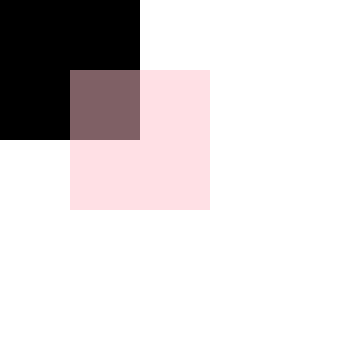

#canvas 笔记5

##1. 合成

###1-2 属性globalAlpha -- 设置透明度

简介：
    该属性将设置或者返回绘图的当前透明度

语法：
    `context.globalAlpha=number;`

参数：
    number的取值范围 0--1;

注：在这条属性下的才会被设置：

```
    <script>
        var c = document.querySelector('canvas');
        var ctx = c.getContext('2d');
        draw();
        function draw () {
            ctx.save();
            ctx.beginPath();

            ctx.fillRect(0, 0, 200, 200);
            ctx.globalAlpha = 0.5;

            ctx.fillStyle = "pink";
            ctx.fillRect(100, 100, 200, 200);


            ctx.closePath();
            ctx.restore();
        }
    </script>
```



###1-3 属性：globalCompositeOperation -- 层叠顺序

简介：
    `globalCompositeOperation`属性设置或返回如何将一个源（新的）图像绘制到目标（已有）的图像上。
    源图像 = 您打算放置到画布上的绘图。放在`globalCompositeOperation`后面的
    目标图像 = 您已经放置在画布上的绘图。放在`globalCompositeOperation`前面的

__语法__:
    `context.globalCompositeOperation="source-in"`

__属性值__:
    source-over
        默认。在目标图像上显示源图像。
    source-atop
        在目标图像顶部显示源图像。源图像位于目标图像之外的部分是不可见的。
    source-in
        在目标图像中显示源图像。只有目标图像内的源图像部分会显示，目标图像是透明的。
    source-out
        在目标图像之外显示源图像。只会显示目标图像之外源图像部分，目标图像是透明的。
    destination-over
        在源图像上方显示目标图像。
    destination-atop
        在源图像顶部显示目标图像。源图像之外的目标图像部分不会被显示。
    destination-in
        在源图像中显示目标图像。只有源图像内的目标图像部分会被显示，源图像是透明的。
    destination-out
        在源图像外显示目标图像。只有源图像外的目标图像部分会被显示，源图像是透明的。
    lighter
        显示源图像 + 目标图像。
    copy
        显示源图像。忽略目标图像。
    xor
        使用异或操作对源图像与目标图像进行组合, 即取反。

```
// 黑色为目标图像，而pink为原图像
    <script>
        var c = document.querySelector('canvas');
        var p = document.querySelector('p');
        var ctx = c.getContext('2d');
        var arr = [
            'source-over',
            'source-atop',
            'source-in',
            'source-out',
            'destination-over',
            'destination-atop',
            'destination-in',
            'destination-out',
            'lighter',
            'copy',
            'xor'
        ]

        draw();
        var num = 0;

        document.onclick  = function () {
            p.innerHTML = arr[num];
            draw()
            num ++;
            num = num % arr.length;
        }

        function draw () {
            ctx.clearRect(0, 0, c.width, c.width);
            ctx.save();
            ctx.beginPath();


            ctx.fillRect(0, 0, 200, 200);
            ctx.fillRect(200, 200, 200, 200);

            ctx.globalCompositeOperation = arr[num];

            ctx.fillStyle = "pink";
            ctx.fillRect(100, 100, 200, 300);


            ctx.closePath();
            ctx.restore();
        }
    </script>
```
<a href="canvas5/globalCompositionOperation.html">动图实例</a>


##2. 将画布导出成图片

### 2.1 方法： toDataURL()

简介：
    将画布导出成图片，然后img可以通过src使用；

语法：
    `c.toDataURL()` -- 返回的是64位的图片信息；

>注： 这里是canvas的方法，不是画布的方法；

```
    <script>
        var c = document.querySelector('canvas');
        var img = document.querySelector('img');
        var ctx = c.getContext('2d');

        draw();

        document.onclick  = function () {
            draw()
        }

        function draw () {
            ctx.clearRect(0, 0, c.width, c.width);
            ctx.save();
            ctx.beginPath();


            ctx.fillRect(0, 0, 200, 200);
            ctx.fillRect(200, 200, 200, 200);

            var i = c.toDataURL();

            ctx.fillStyle = "pink";
            ctx.fillRect(100, 100, 200, 300);


            ctx.closePath();
            ctx.restore();
            img.src = i;
        }
```
<a href="canvas5/toDataURL.html">实例</a>

##3. canvas--事件

### 3.1 -- 方法:isPointInPath()

__简介：__
    isPointInPath() 方法返回 true，如果指定的点位于当前路径中；否则返回 false。

__语法：__
    `context.isPointInPath(x,y)`

__参数:__
    相对于画布的坐标：
    x 测试的 x 坐标
    y 测试的 y 坐标

注：
    实测：
    1. 在由 fillRect || strokeRect 绘制的图形中都不会触发isPointInPath()；
    2. 只在最后一次绘制的路径中判断，

```
    <script>
        var c = document.querySelector('canvas');
        var ctx = c.getContext('2d');

        draw();

        function draw () {
            ctx.clearRect(0, 0, c.width, c.width);
            ctx.save();
// 点击在第一次beginPath()到closePath()中的路径内，isPointInPath判断失败
            ctx.beginPath();

            ctx.fillStyle = "red";
            ctx.rect(0, 0, 200, 200);

            ctx.fill();
            ctx.closePath();
            ctx.restore();

// 点击在第二次beginPath()到closePath()中的路径内，isPointInPath判断成功

            ctx.save();
            ctx.beginPath();

            ctx.fillStyle = "red";
            ctx.rect(200, 200, 200, 200);
            ctx.fillStyle = "#58a";
            ctx.rect(450, 200, 50, 50);

            ctx.fill();
            ctx.closePath();
            ctx.restore();
        }

        c.onmousedown = function (ev) {
            var ev = ev || window.event;
            var x = ev.clientX - c.getBoundingClientRect().left;
            var y = ev.clientY - c.getBoundingClientRect().top;
                console.log(x)
                console.log(y)
            if (ctx.isPointInPath(x, y)) {
                alert(1);
            }
        }
    </script>
```

<a href="canvas5/isPointInPath.html">实例</a>


###3.2 事件的扩展 -- 待补充
