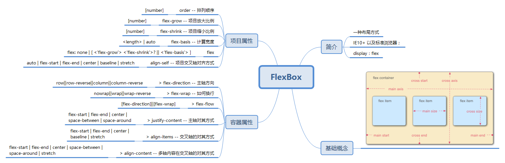
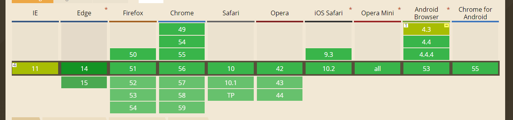

# Learn For LayOut

## 1 Flex 学习

参考：[阮一峰：Flex 布局教程：语法篇](http://www.ruanyifeng.com/blog/2015/07/flex-grammar.html)

### 1.1 简介

Flex 是一种布局解决方案；
传统的布局解决方案是基于盒模型的，主要依赖的是：
1. float
2. display
3. position

但是由于这些方案都有各自的局限性，于是W3C提出了弹性盒模型（flex）的解决方案

目前支持的有：
IE10+ 以及标准浏览器；

### 1.2 基础

Flex是Flexible Box的缩写，意为"弹性布局"，用来为盒状模型提供最大的灵活性。

具有以下特点：

>1. 任何容器都可使用Flex布局（在一些基于chrome内核的老版本浏览器）需要添加 `-webkit-` 前缀；并且设为Flex布局以后，子元素的float、clear和vertical-align属性将失效。

### 1.2.1 基本概念

通过`display: flex`创建flex容器；
采用Flex布局的元素，称为Flex容器（flex container），简称"容器"。它的所有子元素自动成为容器成员，称为Flex项目（flex item），简称"项目"。

概念解释：
> flex container -- flex 容器
> main axis -- 主轴
> main start -- 主轴起始
> main end -- 主轴结束
> cross axis -- 交叉轴
> cross start -- 交叉轴起始
> cross end -- 交叉轴结束
> flex item -- flex 子项
> main size -- 子项横轴尺寸
> cross size -- 子项交叉轴尺寸

### 1.2.2 容器属性

通过下方的页面可以有个更清楚的认识
[DOME1](./dome/dome.html)

一个flex容器具有6个属性：
> flex-direction -- 主轴方向
> flex-wrap -- 如何换行
> flex-flow
> justify-content -- 主轴对其方式
> align-items -- 交叉轴的对其方式
> align-content -- 多轴内容在交叉轴的对其方式

1. flex-direction 主轴方向
`flex-direction` 用于设定容器的主轴方向，即项目的排列方向
语法：
`flex-direction:row||row-reverse||column||column-reverse`
> row -- 主轴水平，起点在左侧
> row-reverse -- 主轴水平，起点在右侧
> column -- 主轴垂直，起点在顶部  
> column -- 主轴垂直，起点在底部

注： 从左到右依次是：column-reverse、column、row、row-reverse

2. flex-wrap 如何换行
默认情况下，项目都排在一条线（又称"轴线"）上。flex-wrap属性定义，如果一条轴线排不下，如何换行。
语法：
`flex-wrap:nowrap||wrap||wrap-reverse`
> nowrap -- 不换行
> wrap -- 第一行放不下是换行
> wrap-reverse -- 优先排列最后一行，放不下的时候换行

3. flex-flow
flex-flow属性是flex-direction属性和flex-wrap属性的简写形式，默认值为row nowrap
语法：
`flex-flow:[flex-direction]||[flex-wrap]`

4. justify-content 主轴对其方式
justify-content属性定义了项目在主轴上的对齐方式。
`justify-content: flex-start | flex-end | center | space-between | space-around;`
> flex-start（默认值）：左对齐
> flex-end：右对齐
> center： 居中
> space-between：两端对齐，项目之间的间隔都相等。
> space-around：每个项目两侧的间隔相等。所以，项目之间的间隔比项目与边框的间隔大一倍。

5. align-items 交叉轴的对其方式
align-items属性定义项目在交叉轴上如何对齐。
语法：
`align-items: flex-start | flex-end | center | baseline | stretch;`
> flex-start：交叉轴的起点对齐。
> flex-end：交叉轴的终点对齐。
> center：交叉轴的中点对齐。
> baseline: 项目的第一行文字的基线对齐。
> stretch（默认值）：如果项目未设置高度或设为auto，将占满整个容器的高度。

6. align-content 多跟轴线对其方式
align-content属性定义了多根轴线的对齐方式。如果项目只有一根轴线，该属性不起作用。
语法：
`align-content: flex-start | flex-end | center | space-between | space-around | stretch;`
>flex-start：与交叉轴的起点对齐。
flex-end：与交叉轴的终点对齐。
center：与交叉轴的中点对齐。
space-between：与交叉轴两端对齐，轴线之间的间隔平均分布。
space-around：每根轴线两侧的间隔都相等。所以，轴线之间的间隔比轴线与边框的间隔大一倍。
stretch（默认值）：轴线占满整个交叉轴。

__注：这里的 align-items 和 align-content 十分相似，如果只有一条主轴线，则使用 align-items 来设置，align-content 更像是对一个内容空间的设置__

### 1.2.3 项目属性
以下6个属性设置在项目上。
>order -- 排列顺序
flex-grow -- 项目放大比例
flex-shrink -- 项目缩小比例
flex-basis -- 计算宽度
flex
align-self -- 项目交叉轴对齐方式

1. order 排列顺序
 order属性定义项目的排列顺序。数值越小，排列越靠前，默认为0。
语法：`order: [num]`

2. flex-grow 放大比例

 flex-grow属性定义项目的放大比例；按照各项的比例对剩余空间进行分配；
 默认为0，即如果存在剩余空间，也不放大。
 语法：`flex-grow: [num]`
 

3. flex-shrink 缩小比例

 [DOME2](./dome/dome1.html)
 flex-shrink属性定义了项目的缩小比例，默认为1，即如果空间不足，该项目将缩小。
 注：如果设置了min-width将以min-width为最小标准；
 语法：`flex-shrink: [num]`
 

 如果所有项目的flex-shrink属性都为1，当空间不足时，都将等比例缩小。如果一个项目的flex-shrink属性为0，其他项目都为1，则空间不足时，前者不缩小。
 注：负值对该属性无效。

4. flex-basis 计算尺寸

 flex-basis属性定义了在分配多余空间之前，项目占据的主轴空间（main size）。浏览器根据这个属性，计算主轴是否有多余空间。它的默认值为auto，即项目的本来大小。
 语法：  `flex-basis: <length> | auto; /* default auto `

 如果设定的值和 width 或者 height 的值相同，就会占据固定的空间

5. flex

 flex属性是flex-grow, flex-shrink 和 flex-basis的简写，默认值为0 1 auto。后两个属性可选。
 语法：
 `flex: none | [ <'flex-grow'> <'flex-shrink'>? || <'flex-basis'> ]`
 - 该属性有两个快捷值：auto (1 1 auto) 和 none (0 0 auto)。
 - 建议优先使用这个属性，而不是单独写三个分离的属性，因为浏览器会推算相关值。

6. align-self 项目交叉轴对齐方式
 [DOME3](./dome/dome2.html)
 align-self属性允许单个项目有与其他项目不一样的对齐方式，可覆盖align-items属性。默认值为auto，表示继承父元素的align-items属性，如果没有父元素，则等同于stretch
 语法：
 `align-self: auto | flex-start | flex-end | center | baseline | stretch;`
 
