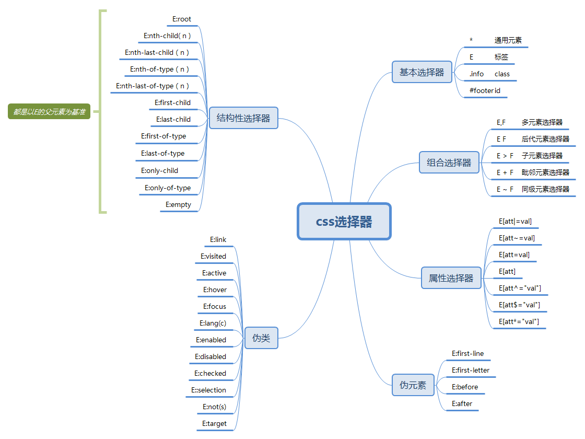

# Learn Css

## 1 noteForCss选择器

对于 css 选择器，一直没有很好的整理，看到阮一峰关于css选择器的文章，对将其记录下来
地址：http://www.ruanyifeng.com/blog/2009/03/css_selectors.html
原作者：阮一峰

选择器共有44种

### 1.1 css2.1 选择器

#### 1.1.1 基本选择器

1.	*	通用元素选择器，匹配任何元素
2.	E	标签选择器，匹配所有使用E标签的元素
3.	.info	class选择器，匹配所有class属性中包含info的元素
4.	#footer	id选择器，匹配所有id属性等于footer的元素

#### 1.1.2 多元素的组合选择器

5.	E,F	多元素选择器，同时匹配所有E元素或F元素，E和F之间用逗号分隔
6.	E F	后代元素选择器，匹配所有属于E元素后代的F元素，E和F之间用空格分隔
7.	E > F	子元素选择器，匹配所有E元素的子元素F
8.	E + F	毗邻元素选择器，匹配所有紧随E元素之后的同级元素F

#### 1.1.3 CSS 2.1 属性选择器

9.	E[att]	匹配所有具有att属性的E元素，不考虑它的值。（注意：E在此处可以省略，比如"[cheacked]"。以下同。）
10.	E[att=val]	匹配所有att属性等于"val"的E元素
11.	__E[att~=val]	匹配所有att属性具有多个空格分隔的值、其中一个值等于"val"的E元素__
12.	__E[att|=val]	匹配所有att属性具有多个连字号分隔（hyphen-separated）的值、其中一个值以"val"开头的E元素，主要用于lang属性，比如"en"、"en-us"、"en-gb"等等__

#### 1.1.4 CSS 2.1中的伪类

13.	__E:first-child	匹配父元素的第一个子元素__
14.	E:link	匹配所有未被点击的链接
15.	E:visited	匹配所有已被点击的链接
16.	E:active	匹配鼠标已经其上按下、还没有释放的E元素
17.	E:hover	匹配鼠标悬停其上的E元素
18.	E:focus	匹配获得当前焦点的E元素
19.	__E:lang(c)	匹配lang属性等于c的E元素__

#### 1.1.5 CSS 2.1中的伪元素

20.	__E:first-line	匹配E元素的第一行__
21.	__E:first-letter	匹配E元素的第一个字母__
22.	E:before	在E元素之前插入生成的内容
23.	E:after	在E元素之后插入生成的内容

### 1.2 CSS 3 相关选择器

#### 1.2.1 CSS 3的同级元素通用选择器
序号	选择器	含义
24.	E ~ F	匹配任何在E元素之后的同级F元素

#### 1.2.2 CSS 3 属性选择器

25.	E[att^="val"]	属性att的值以"val"开头的元素
26.	E[att$="val"]	属性att的值以"val"结尾的元素
27.	E[att*="val"]	属性att的值包含"val"字符串的元素

#### 1.2.3 CSS 3中与用户界面有关的伪类

28.	E:enabled	匹配表单中激活的元素
29.	E:disabled	匹配表单中禁用的元素
30.	E:checked	匹配表单中被选中的radio（单选框）或checkbox（复选框）元素
31.	E::selection	匹配用户当前选中的元素

#### 1.2.4 CSS 3中的结构性伪类

32.	E:root	匹配文档的根元素，对于HTML文档，就是HTML元素
33.	E:nth-child(n)	匹配其父元素的第n个子元素，第一个编号为1
34.	E:nth-last-child(n)	匹配其父元素的倒数第n个子元素，第一个编号为1
35.	E:nth-of-type(n)	与:nth-child()作用类似，但是仅匹配使用同种标签的元素
36.	E:nth-last-of-type(n)	与:nth-last-child() 作用类似，但是仅匹配使用同种标签的元素
37.	E:last-child	匹配父元素的最后一个子元素，等同于:nth-last-child(1)
38.	E:first-of-type	匹配父元素下使用同种标签的第一个子元素，等同于:nth-of-type(1)
39.	E:last-of-type	匹配父元素下使用同种标签的最后一个子元素，等同于:nth-last-of-type(1)
40.	E:only-child	匹配父元素下仅有的一个子元素，等同于:first-child:last-child或 :nth-child(1):nth-last-child(1)
41.	E:only-of-type	匹配父元素下使用同种标签的唯一一个子元素，等同于:first-of-type:last-of-type或 :nth-of-type(1):nth-last-of-type(1)
42.	E:empty	匹配一个不包含任何子元素的元素，注意，文本节点也被看作子元素

#### 1.2.5 CSS 3的反选伪类

43.	E:not(s)	匹配不符合当前选择器的任何元素

#### 1.2.6 CSS 3中的 :target 伪类

44.	E:target	匹配文档中特定"id"点击后的效果
