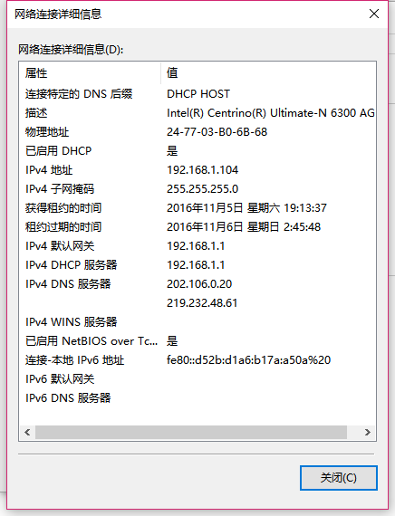
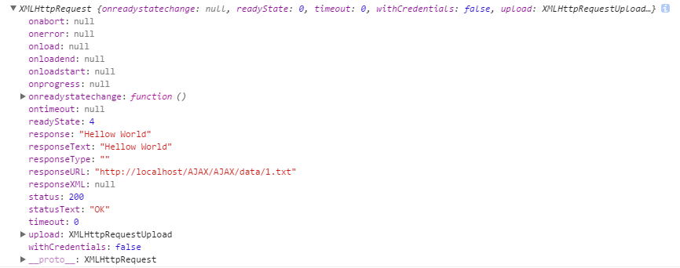
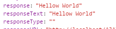

#AJAX

服务器搭建 || AJAX简介

##1. 服务器搭建--PHP环境

WAMP安装 || WAMP简介

###1.1-安装
这里使用软件WAMP
百度下载安装，安装目录中不能有中文
注：
问题1：如何使用手机访问?
首先通过 将WAMP切换到在线模式

获取IPv4中的地址，在手机中输入该地址访问；
如果访问失败，查看自己的WAMP中的Apach的版本号，百度：WAMP 局域网访问找寻解决方法

例：2.49下解决方式：
http://jingyan.baidu.com/article/0eb457e53354a803f1a90514.html?st=2&os=0&bd_page_type=1&net_type=1

具体：

找到 httpd.conf
<Directory>
Require local
</Directory>
将
Require local
修改为
Require all granted

问题2：wampserver 主页里点击“Your Projects”下面项目名，地址错误的问题

解决方法：
http://www.bubuko.com/infodetail-1417206.html

这时需要找到www文件夹下的index.php文件，然后修改里面查找$projectContents，或直接查看338行代码，修改‘http://‘为‘http://localhost/‘即可。

##1.2-WAMP的简单介绍

根目录下www文件夹为服务器的根目录；
在本机上通过127.0.0.1 或者 localhost 访问;
手机上 通过ip地址访问

不要在开启前使用可能会占用80端口的软件，例如：下载软件和视频播放软件

##2. AJAX 简介

AJAX -- Asynchronous JavaScript and XML

功能：利用JS中的异步形式操作XML，主要完成数据交互；

异步的优点：
1. 减少数据请求；
2. 节省用户时间；
3. 提高用户体验；

##3. 后端接受数据的两种形式（PHP）：

```
<?php
header('content-type:text/html;charset="utf-8"');
error_reporting(0);

$username = $_GET['username'];
$age = $_GET['age'];

echo "你的名字：{$username}，年龄：{$age}";
```
以GET方式获取；

```
<?php
header('content-type:text/html;charset="utf-8"');
error_reporting(0);
//$_REQUEST
$username = $_POST['username'];
$age = $_POST['age'];

echo "你的名字：{$username}，年龄：{$age}";
```
以POST方式获取；

_补充：_
>form中的属性(部分)，
action URL 规定当提交表单时向何处发送表单数据。
enctype  规定在发送表单数据之前如何对其进行编码。
method-- get || post 规定用于发送 form-data 的 HTTP 方法。
其中enctype 和 method需要注意

>enctype 属性可能的值：
application/x-www-form-urlencoded
multipart/form-data
text/plain

>method中使用get传输，传输内容会以name = value & name = value的形式显示在url后面，后端可以通过GET在url中获取，注意这里操作的都是字符串格式，get传输的内容有长度限制，大概在2000左右
而使用POST是通过请求头发送的（不会被缓存）可以通过网络监控获取，可以传输各种数据；通过POST传输的数据长度理论上无限制，实际默认在8M左右；

##4.AJAX简单工作过程介绍：

```
    oBtn.onclick = function() {
        //打开浏览器
        var xhr = new XMLHttpRequest();
        //在地址栏输入地址
        hr.open('get','1.txt',true);
        //提交
        xhr.send();
        //等待服务器返回内容
        xhr.onreadystatechange = function() {
            if ( xhr.readyState == 4 ) {
                alert( xhr.responseText );
            }
        }
    }
```

###4.1 - 第一步创建一个AJAX对象：

new XMLHttpRequest() || new AtiveXObject('Micrisoft.XMLHTTP') || 兼容处理

`var xhr = new XMLHttpRequest()`
这种创建方式有兼容性的问题--IE6
在IE6中需要使用ActiveXObject插件完成兼容：
具体：
`xhr = new ActiveXObject('Microsoft.XMLHTTP');`

兼容处理：
```
方式一：
var xhr = null;
if (window.XMLHttpRequest) {
    xhr = new XMLHttpRequest();
} else {
    xhr = new ActiveXObject('Microsoft.XMLHTTP');
}
方式二：
try {
    xhr = new XMLHttpRequest();
} catch (e) {
    xhr = new ActiveXObject('Microsoft.XMLHTTP');
}
```

补：
```

try {
    //代码尝试执行这个块中的内容,如果有错误，则会执行catch{}，  并且传入错误信息参数
    //alert(a);
    //new throw();
    //throw new Error('错了错了');
} catch (e) {
    alert(e);
}
```

###4.2 - 第二步向服务器发送请求：

open() || send()

XMLHttpRequest对象的方法：

1）open()
简介：
    规定请求的类型、URL 以及是否异步处理请求。

语法：
    `xhr.open(method,url,async)`

参数：
    1. method--请求的类型：get || post
    2. url--服务器上文件的地址
    3. async--是否异步：true || false

>注：
1. GET 还是 POST？
与 POST 相比，GET 更简单也更快，并且在大部分情况下都能用。
然而，在以下情况中，请使用 POST 请求：
**无法使用缓存文件（更新服务器上的文件或数据库）**
向服务器发送大量数据（POST 没有数据量限制）
发送包含未知字符的用户输入时，POST 比 GET 更稳定也更可靠
2. 是否异步？
当后面的行为必须在前面的行为或者数据完成后进行，才可能需要使用同步；
首先：如果使用AJAX，建议async参数设置为true：
异步 -- 非阻塞(true) 非异步 -- 阻塞(false)
AJAX使用异步优点：
- 在等待服务器响应时执行其他脚本
- 当响应就绪后对响应进行处理

2）send()
简介：
    将由open规定好的请求方式，发送到服务器；

语法：
    `send(string)`

参数：
    string：可选仅用于 POST 请求


###4.3 - 第三步：等待服务器相应

responseText || responseXML || onreadystatechange() ||

xhr对象内容:（仅仅是继承了XMLHttpRequest部分，例如：get和send都是XMLHttpRequest的）


1）属性1：responseText || responseXML: 用于存放服务器返回的数据，
responseText 获得字符串形式的响应数据。
responseXML 获得 XML 形式的响应数据。
注：在服务器返回数据之前，这里为空;



2）事件1：onreadystatechange();

简介：用于监控ajax的工作状态(属性：readyState),当readyState发生改变的时候就会触发。

3）属性2：readyState
简介：
    存放XMLHttpRequest的状态；
值：
    0--初始化，这是还没有调用open();
    1--载入，已经发送请求(send());
    2--载入完成，已经收到了服务器返回的内容；
    3--解析，解析服务器响应的内容；
    4--完成，解析完成，可以使用响应的内容；

4）属性3：statue
简介：
    服务器状态
值：
    http状态码：
    常用的有：200 -- 请求成功；404 -- 请求失败

#### ！由于有时请求的内容并不一定存在，所以要做容错处理

```
    <script>
        var oBtn = document.querySelector('input');
        oBtn.onclick = function () {
            var xhr = new XMLHttpRequest();
            // data/2 -- 不存在
            xhr.open('get', '1.txt', true);
            xhr.send();
            console.log(xhr);
            xhr.onreadystatechange = function () {
                if (xhr.readyState == 4) {
                    if (xhr.status == 200) {
                        alert(xhr.responseText) // 如果加载完成，并且请求内容存在时
                    } else {
                        document.body.innerHTML = xhr.status + xhr.readyState;  // 如果加载失败,将错误的Http代码显示出来；
                    }
                }
            }
        }
    </script>
```


##5.JSON -- 简单补充：

简介 || JSON.stringify() || JSON.parse()

JSON 指的是 JavaScript 对象表示法（JavaScript Object Notation）
JSON 是存储和交换文本信息的语法。类似 XML。
JSON 比 XML 更小、更快，更易解析。

>注： JSON 使用 JavaScript 语法来描述数据对象，但是 JSON 仍然独立于语言和平台。JSON 解析器和 JSON 库支持许多不同的编程语言。

- 类似 XML
JSON 是纯文本
JSON 具有“自我描述性”（人类可读）
JSON 具有层级结构（值中存在值）
JSON 可通过 JavaScript 进行解析
JSON 数据可使用 AJAX 进行传输
相比 XML 的不同之处：1.没有结束标签。2.更短。3.读写的速度更快。4.能够使用内建的 JavaScript eval() 方法进行解析。5.使用数组。6.不使用保留字

- 为什么使用 JSON？
对于 AJAX 应用程序来说，JSON 比 XML 更快更易使用：
使用 XML
读取 XML 文档
使用 XML DOM 来循环遍历文档
读取值并存储在变量中

使用 JSON
读取 JSON 字符串
用 eval() 处理 JSON 字符串

- JSON 文件
JSON 文件的文件类型是 ".json"
JSON 文本的 MIME 类型是 "application/json"


我们从服务器接受的数据或者是提交的数据可能是各种各样，有时我们需要改变数据的格式
例如：json  <----> String 的转换：

首先：objectJson对象在IE7及以下不识别，需要引入相应的js文件做兼容处理；

<a href="JSON.js">兼容文件</a>

方法：JSON.stringify() || JSON.parse()

JSON.stringify() --- JSON 转 字符串
JSON.parse() --- 字符串 转 JSON

注：
1. 在转换的过程中，格式十分严格，JSON中的key值必须使用双引号；
2. AJAX只要功能是获取数据，而具体的操作是DOM操作的；

```
//alert(JSON)

//stringify : 可以把一个对象转成对应字符串

var arr = [1,2,3];
var j = {left:100};
/*alert( JSON.stringify(arr) );*/
/*alert( JSON.stringify(j) );*/

//parse : 可以把字符串转成对应对象
var s1 = '[100,200,300]';
var a1 = JSON.parse(s1);
//alert(a1[0])

var s2 = '{"left":100}';
var a2 = JSON.parse(s2);
alert(a2.left)
```

JSON 接受的格式十分严格，必须是在双引号中，如果后端并没有传输正确的格式，比如使用了单引号，就不能正确使用，

解决方法：
1. 使用eval('('+ neiyong +')');
2. 使用new Function('', 'return'+ neiyong)();


##6 - 进一步了解  open () 中的 get 和 post

###6.1 - get方式
首先分析：
```
<?php
header('content-type:text/html;charset="utf-8"');
error_reporting(0);

// 接收GET提交的数据
$username = $_GET['username'];
$age = $_GET['age'];

// echo 的内容是返回出去的；
echo "你的名字：{$username}，年龄：{$age}";
```


格式：

```
    <script>
        var oBtn = document.querySelector('input');
        oBtn.onclick = function () {
            var xhr = new XMLHttpRequest();
            xhr.open('get', '1.open.php?username= '+encodeURI('刘伟')+'&age=30&' + new Date().getTime(), true);
            xhr.send();
            console.log(xhr);
            xhr.onreadystatechange = function () {
                if (xhr.readyState == 4) {
                    if (xhr.status == 200) {
                        alert(xhr.responseText) // 如果加载完成，并且请求内容存在时
                    } else {
                        document.body.innerHTML = xhr.status + xhr.readyState;  // 如果加载失败,将错误的Http代码显示出来；
                    }
                }
            }
        }
    </script>
```

分析：在传输的URL中，1.open.php是文件名，?后面的就是向后端提供的内容（表单的提交就是这样的），后端通过GET接收；

注：
1. 为什么要使用encodeURI()
答：为了解决中文乱码的问题；

2. 为什么最后要加上时间戳
答：为了解决缓存问题，在使用get方式提交的时候，会使用缓存，即如果请求的url相同，就会直接从缓存中返回数据，如果这时后端的数据修改了，就不能接受新的数据，所以要在url后面添加个永远不会重复的后缀--时间戳，让其每次都能从后端接受新的数据。
<!-- 目前，实验没有出现缓存问题 -->

###6.2 - post()方式

```
<?php
header('content-type:text/html;charset="utf-8"');
error_reporting(0);

$username = $_POST['username'];
$age = $_POST['age'];

echo "你的名字：{$username}，年龄：{$age}";
```

格式:

```
    <script>
        var oBtn = document.querySelector('input');
        oBtn.onclick = function () {
            var xhr = new XMLHttpRequest();
            xhr.open('post', '2.open.php', true);

            xhr.setRequestHeader('content-type', 'application/x-www-form-urlencoded');//申明发送的数据类型

            xhr.send('username=刘伟&age=30');
            console.log(xhr);
            xhr.onreadystatechange = function () {
                if (xhr.readyState == 4) {
                    if (xhr.status == 200) {
                        alert(xhr.responseText) // 如果加载完成，并且请求内容存在时
                    } else {
                        document.body.innerHTML = xhr.status + xhr.readyState;  // 如果加载失败,将错误的Http代码显示出来；
                    }
                }
            }
        }
    </script>
```

post的请求头 -- 方法：setRequestHeader()
语法：
    `setRequestHeader(header,value) 向请求添加 HTTP 头。`

参数：
    header: 规定头的名称
    value: 规定头的值


注：
1. 在POST方式传输数据时，传输的内容在send中，而get是在url中；
2. POST的方式不需要encodeURI(),因为在请求头中就已经说明了数据储存格式了；
3. POST没有缓存的问题，因为post是提交数据，而提交数据不会有缓存，而get是获取数据，而获取数据就会存在缓存。

##7. AJAX实例

请求一组新闻

```
    <script>
        var oBtn = document.querySelector('input');
        var list = document.querySelector('ul');
        oBtn.onclick = function () {
            var xhr = null;
            try {
                xhr = new XMLHttpRequest();
            } catch(e) {
                xhr = new ActiveXObject('Microsoft.XMLHttp')
            }
            var xhr = new XMLHttpRequest();
            xhr.open('get', 'getNew.php', true);
            xhr.send();
            xhr.onreadystatechange = function () {
                if (xhr.readyState == 4) {
                    if (xhr.status == 200) {
                        var data = JSON.parse(xhr.responseText);
                        var str = '';
                        for (var i = 0; i < data.length; i++) {
                            str += '<li><a href="">'+data[i].title+'</a> [<span>'+data[i].date+'</span>]</li>';
                            list.innerHTML = str;
                        }
                    }
                }
            }
        }
    </script>
```

实例二：ajax的封装：

```
    
function ajax(method, url, data, suc) {
    var xhr = null;
    try {
        xhr = new XMLHttpRequest();
    } catch(e) {
        xhr = new ActiveXObject('Microsoft.XMLHttp')
    }

    if (method == 'get' && data) {
        url += '?' + data;
    }

    xhr.open(method, url, true)

    if (method == 'get') {
        xhr.send();
    } else {
        xhr.setRequestHeader('content-type', 'application/x-www-form-urlencoded')
        xhr.send(data);
    }
    xhr.onreadystatechange = function () {
        if (xhr.readyState == 4) {
            if (xhr.status == 200) {
                suc&&suc(xhr.responseText);
            } else {
                alert(xhr.status);
            }
        }
    }
}

```