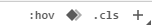
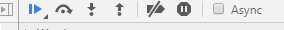

# note For Debugger

这里主要记录的是 chrome 浏览器下的审查元素的使用方法

## 1. css 与 html 调试

在审查元素中对css 和 html 调试，主要使用 Elements 选项卡；

常用的就不提了；

就简单补充一些：

;

 - 使用 + 可以直接添加样式
 - 点击颜色前的色块可以调出选项卡
 - 检查hover 时 的效果，有两种方法 ： 1. 在hover的时候右键选检查。2. 使用：hov 中选择hover
 - 在有层次的那个选项中可以检测animation

## 2. js

在sources中可以审查js文件

 - 使用 ctr+p 可以检索文件
 - 在左侧行数上点击可以打断点，
 - 点击图中的第一个按钮，可以对代码进行审查，恢复运行的时候就执行代码，如果遇到断点就停止运行；
 - 点击图中的第二个按钮就是执行到下一步，如果鼠标放到变量的位置上就会显示变量的值，但是这种一步一步的执行并不会进入当前函数；
 - 如果需要对一个变量做到实时监控，就对这个变量右击，选择 add to watch 这样在右侧的watch选项中就会实时的观察到这个变量
 - 点击图中第三个按钮，就会进入到当前函数中进行审查
 - 点击图中的第四个按钮，就会跳出函数，进入到上级环境中
 - 图中第五个按钮，会关闭所有的断点（仅仅是控制关闭和开启）
 - 在右侧的break points 中可以管理所有的断点，右键可以选择清除所有的断点的功能
 - 点击第六个按钮，就会停留在代码异常的位置
 - ctrl + shift + f -- 执行全文件内容的检索

 ## 3. ajax的调试

 在ajax回调中，打上断点可以审查返回数据

 在 network 中可以审查fromdata 从而得到提交的相关信息
 如果发送的内容的状态是 pending 并且始终是灰色进度条，那么就是后端一直没有返回数据

 ## 4. 事件断点

 在 sources 中，右侧还存在一个 event listener breakpoints 用于监测事件从而生成断点
 ；也就是当勾选的事件发生的时候，就会显示这个事件是在代码中什么位置触发的

 net::------ 这个信息是错误代码

 ## 5. 移动端调试

 在移动端调试的时候，选择 moretools（在关闭审查元素的x号旁边，点击显示为一列点选项就能查找的到） 可以使用network模拟流量，可以通过useragent 来模拟页面的useragent信息

 这些仅仅是很少的一部分，以后如果遇到会不断添加的
 
