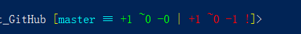

# Git & GitHub

Git: 版本控制，利于多人合作；

GitHub：远程仓库，网站，个人项目；

## 1. 基本介绍

###1.1 svg || git || GitHub

svg: 集成式--寄托于中央服务器；
git：分布式--寄存于每台电脑，存于本地；
GitHub：远程仓库；

通过git储存，然后上传至GitHub，多人都可以从GitHub上下载，维持多人协作；
git保障了数据安全，远程仓库保障了多人协作；

## 2. git 命令行开发

### 2.1 第一步基本配置：

1）在Git上创建一个仓库；

2）通过`cd 路径`找到存放的路径；
`cd ..`--返回上一级
`cd /`--返回当前的根目录

3）命令`git clone url` 下载仓库；

4）设置贡献者：
命令：
`git config --global user.name [用户名]`
`git config --global user.emall [邮箱名]`
`git config --list`

### 2.2 基础理论

1）什么是master

master是主分支，在主分支上可以附着一些小分支，小分支可以独立维护，如果需要可以将小分支融合到主分支上；

2）工作区 || 暂存区 || 版本区 -> master(相当于服务器)

优点：分支处理、过滤、保护
注：一个文件只能处于一个阶段

3）git stauts 查看状态
当相对于版本区有新的文件时，该文件还没有进行管理，文件名显示红色，表示文件处于工作区；绿色就代表暂存区，看不到版本区

### 2.3 提交

1）工作区 -> 暂存区
使用`git add 文件名(带后缀)`，将工作区的文件添加到暂存区；
快捷：`git add *` 代表着一次上传所有工作区里的内容

[master ≡ +1 ~0 -0 | +1 ~0 -1 !]

其中红色的代表工作区的修改，绿色的代表暂存区的修改；

+1 -- 代表有一个新的文件
~0 -- 代表修改了0个文件
-1 -- 代表着减少了1个文件

2）暂存区 -> 版本区
使用`git commit 文件名(带后缀)`, 将暂存区文件添加到版本区；
会弹出一个文本文档，输入简介内容后保存关闭
快捷：
`git commit -m "这里写简介"`

`git commit -a -m`直接将工作区的提交到版本区

[master ↑ +2 ~0 -1 !]>

3）`git log` -- 查看日志

会显示版本的
1. 版本号
2. 操作者
3. 时间

不断回车不断查看
通过q 退出查看日志模式

### 2.4 对比

1）工作区 <=> 暂存区

不断回车不断查看
通过q 退出查看日志模式

7）其他

`ls` 查看当前路径中的文件信息
`clear`清空面板
`cd ..`返回路径的上一级
`cd 路径`到达指定路径