# LearnGit

参考
[廖雪峰-git](http://www.liaoxuefeng.com/wiki/0013739516305929606dd18361248578c67b8067c8c017b000/)

<!-- TOC -->

- [LearnGit](#learngit)
    - [1. Git 基本介绍](#1-git-基本介绍)
        - [1.1 集中式和分布式](#11-集中式和分布式)
        - [1.2 Git 基础](#12-git-基础)
        - [1.3 Git 的安装](#13-git-的安装)
    - [2 Git 的基本使用](#2-git-的基本使用)
        - [2.1 创建版本库](#21-创建版本库)
        - [2.2 添加文件](#22-添加文件)
        - [2.2 仓库状态](#22-仓库状态)
        - [2.3 版本回退](#23-版本回退)
        - [2.4 工作区和暂存区](#24-工作区和暂存区)
        - [2.4 管理修改](#24-管理修改)
            - [2.4.1 撤销更改](#241-撤销更改)
            - [2.4.2 删除文件](#242-删除文件)

<!-- /TOC -->

## 1. Git 基本介绍

Git -- 分布式版本控制系统

什么是版本控制？
版本控制是一种记录文件变化以便查看特定版本修订情况的系统；

- 保存和恢复：  
    我们可以使用这个系统对文件随时进行保存，并能够将当前某个文件回溯到某个以保存的状态，甚至可以做到将整个项目都回退到过去的某个时间点；
- 比较
    可以将当前文件与其历史文件进行对比，查看变化细节、由谁修改、修改了什么地方、什么时间等细节信息；
- 安全
    使用了版本控制系统，意味着即使文件已经被删除或者修改，也可以恢复到原先的样子

### 1.1 集中式和分布式

集中式的版本控制系统比较典型的是 SVN；

- 集中式：
    1. 集中式的版本控制系统，版本库是集中存放在中央服务器中的，在开发的前从中央服务器中取得最新的版本，而在开发后在将文件推送给重要服务器；
    2. 集中式的缺点：必须联网才能工作，受到网速的限制

    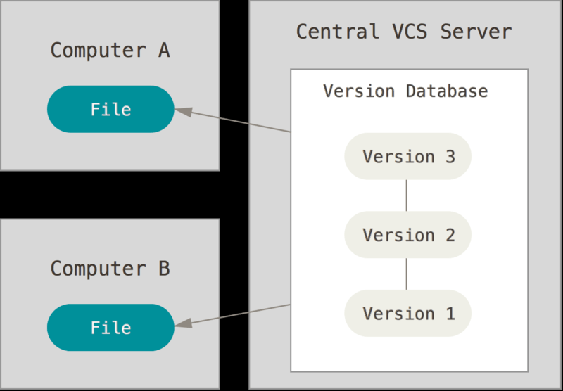
    
- 分布式
    1. 分布式的版本控制系统，客户端并不是仅仅提取最新版本的文件快照，而是将代码仓库完整的镜像下来；这样即使任何一处协同工作用的服务器发生故障，时候都可以用任何一个镜像进行恢复，在写作的时候，将各自的修改推送给对方，就可以看到对方的修改了，但是使用分布式的版本控制系统的时候，很少会在两个人之间的电脑上推送版本库的修改；而是使用一个充当中央服务器的电脑，来方便交换大家的修改；
    2. 分布式的优势：多个完整的版本库并存使得系统的安全性要高很多；并且具有强大的分支管理

    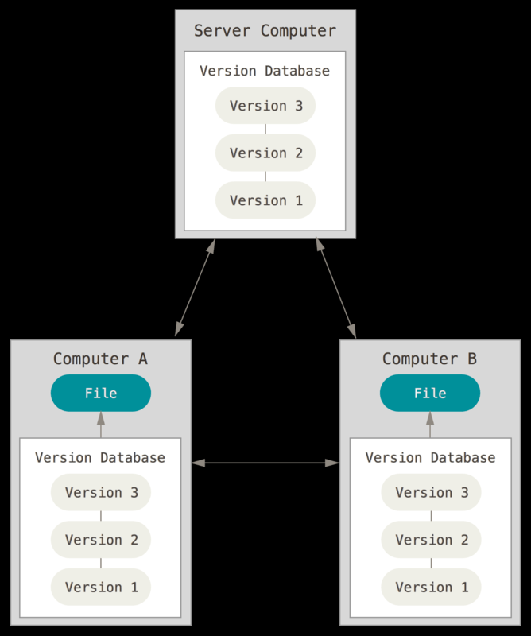

### 1.2 Git 基础

Git 和其它的版本控制工具重要的区分在于，git 在保存项目状态的时候，对当时的全部文件制作一个快照并保存这个快照的索引，如果文件没有发生修改，git 将不会重新储存改文件，而是只保留一个指向之前储存文件的连接
（其余的版本控制主要是保存每一个文件随着时间变化发生的差异）

- 所有操作都是本地操作
    由于每一个客户端都保留着完整的文件，所以所有的操作都可以在本地操作；在没有网络的情况下也可以在本地进行提交然后等到有网的时候在进行上传；

- Git 保证完整性
    Git 用以计算校验和的机制叫做 SHA-1 散列（hash，哈希）。 这是一个由 40 个十六进制字符（0-9 和 a-f）组成字符串，__基于 Git 中文件的内容或目录结构计算出来__。 SHA-1 哈希看起来是这样：
    `24b9da6552252987aa493b52f8696cd6d3b00373`
    git 中所有数据在储存前都计算校验和，然后以校验和进行引用；如果在传送的过程中丢失信息或者损坏文件，必然导致 hash 不同，Git 就能发现；

- Git 一般只添加数据
    一般在 Git 中的操作很难执行任何不可逆操作，一旦进行了提交快照到 Git 中，就很难以任何方式清除数据；

- 三种状态
    已提交、已修改、已暂存
    已提交 -- 表示数据已经安全的保存在本地数据库中；
    已修改 -- 表示修改了文件，但是还没保存到数据库中，
    已暂存 -- 表示对一个已修改的文件进行标记，以便包含在下一次提交中；


git repository -- git 仓库；
用于保存项目的元数据和对象数据库的地方，这是 git 中最重要的地方，当在克隆仓库的时候，拷贝的就是这里的数据；

work directory -- 工作目录；
工作目录是对项目的某个版本独立提取出来的内容，这些从 git 仓库的压缩数据库中提取的文件，放在磁盘上供自己修改；

staging area -- 暂存区：
暂存区是一个文件，保存下次将要提交的问价列表信息，一般在 git 仓库目录中，有时候也叫索引；

基本的 Git 工作流程如下：
在工作目录中修改了文件；
暂存文件，将文件的快照放入暂存区域；
提交更新，找到暂存区域文件，将快照永久性储存到 Git 仓库目录；

注意：文件只会存在一种状态；


### 1.3 Git 的安装

目前 Git 官网已提供 window 使用的 Git 可以直接安装使用；安装软件方式就不做细说；

附上：
[廖雪峰 git 安装地址](http://www.liaoxuefeng.com/wiki/0013739516305929606dd18361248578c67b8067c8c017b000/00137396287703354d8c6c01c904c7d9ff056ae23da865a000)
[官网安装教程](https://git-scm.com/book/zh/v2/%E8%B5%B7%E6%AD%A5-%E5%AE%89%E8%A3%85-Git)

## 2 Git 的基本使用

__使用前须知__
既然已经在系统上安装了 Git，你会想要做几件事来定制你的 Git 环境。 每台计算机上只需要配置一次，程序升级时会保留配置信息。 你可以在任何时候再次通过运行命令来修改它们。

1. Git 自带一个 git config 的工具来帮助设置控制 Git 外观和行为的配置变量。 这些变量存储在三个不同的位置：
1. `/etc/gitconfig` 文件: 包含系统上每一个用户及他们仓库的通用配置。 如果使用带有 `--system` 选项的 `git config` 时，它会从此文件读写配置变量。
1. `~/.gitconfig` 或 `~/.config/git/config` 文件：只针对当前用户。 可以传递 `--global` 选项让 Git 读写此文件。
1. 当前使用仓库的 Git 目录中的 config 文件（就是 .git/config）：针对该仓库。

每一个级别覆盖上一级别的配置，所以 .git/config 的配置变量会覆盖 /etc/gitconfig 中的配置变量。
在 Windows 系统中，Git 会查找 `$HOME` 目录下（一般情况下是 `C:\Users\$USER`）的 `.gitconfig` 文件。 Git 同样也会寻找 `/etc/gitconfig` 文件，但只限于 `MSys` 的根目录下，即安装 Git 时所选的目标位置。

__设置贡献者__
当安装完 Git 应该做的第一件事就是设置你的用户名称与邮件地址。

```txt
`git config --global user.name "用户名"`
`git config --global user.emall "邮箱名"`
`git config --list`
```

再次强调，如果使用了 `--global` 选项，那么该命令只需要运行一次，因为之后无论你在该系统上做任何事情， Git 都会使用那些信息。 当你想针对特定项目使用不同的用户名称与邮件地址时，可以在那个项目目录下运行没有 `--global` 选项的命令来配置。

__文本编辑__

当 Git 需要输入信息的时候(如：添加提交信息的时候)，会调用操作系统默认的文本编辑器，如果需要制定默认的编辑器，需要通过命令设置 -- `git config --global core.editor emacs`；

我们可以通过命令：`git config --list` 的方式查看 config 信息，也可以通过 `git config xxx` 查看制定的信息；（如果Git读取多个文件的时候，出现了同样的配置信息，将会采用最后的一个）

__Git Help__
通过 `git help xxx` 能查找到相关命令的手册


### 2.1 创建版本库

版本库又叫做仓库：repository, 在这个仓库下面的文件都可以被 Git 管理起来，git可以追踪每一个文件的修改、删除；从而可以实现版本还原；

创建版本库：

- 第一种是在现有项目或目录下导入所有文件到 Git 中  
    本地创建：
    找到一个合适的目录
    1. `mkdir learnGit` -- 创建一个 learnGit 文件夹
    2. `cd learnGit` -- 进入创建的文件夹
    3. `pwd` -- 输出当前路径
    4. `git init` -- 创建 git 仓库，这时会在当前目录下面创建一个 .git 目录(配置文件-config，就在这个目录下)，这个目录就是 git 用于跟踪管理版本库的；

- 克隆现有的仓库
    进入需要保存文件的路径，然后通过 `git clone 地址` 的方式下载到本地, 通过命令 `git clone` 方式下载的文件是对远程文件的完整拷贝；如果需要在克隆远程仓库的时候，自定义本地仓库的名字，可以使用命令：`git clone 地址 本地仓库名` 的方式添加；

补充：[再服务器上搭建仓库](https://git-scm.com/book/zh/v2/%E6%9C%8D%E5%8A%A1%E5%99%A8%E4%B8%8A%E7%9A%84-Git-%E5%9C%A8%E6%9C%8D%E5%8A%A1%E5%99%A8%E4%B8%8A%E6%90%AD%E5%BB%BA-Git#_git_on_the_server)

- 注：
    1. 最好不要使用中文路径；
    2. 使用 tab 可以自动补全路径；
    3. 使用 `ls` 可以查看当前文件夹下的子文件，`ls -ah` 可以查看被隐藏的文件；
    4. git 只能跟踪文本文件（最好是UTF-8的编码格式）的改动；
    
### 2.2 添加文件


在创建好的文件夹中，添加一个文件（比如：git.txt）;文件内容如下:

```txt
这是创建的一个文本，用于测试git
Git is free software.
```

1. 可以通过 `git add git.txt` 来将文件添加到仓库；
2. 通过 `git commit -m "注释"` 可以将文件提交到仓库

- 注：
    1. 使用 `cd > git.txt` 可以创建文件--git.txt;
    2. 输入 git.txt 就可以直接打开；
    3. 使用 `dir` 可以查看子文件；
    4. 同样可以通过使用 tab 来进行补全；

- 补上这一段命令在 git 中的表现

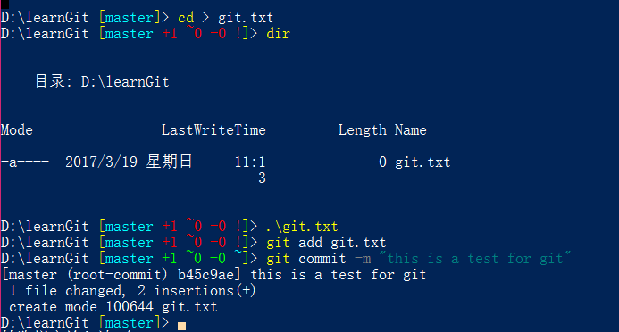;

### 2.2 仓库状态

在一个仓库中，文件状态只会有两种：1. 已跟踪文件；2. 未跟踪文件；

已跟踪文件：是指那些被纳入了版本控制的文件，在上一次快照中有他们的记录，在工作一段时间的后，他们的状态可能存在未修改、已修改或者已放入暂存区；  
未跟踪文件：是指那些没有被纳入版本控制的文件，也不存在于暂存区中；

对于已经跟踪文件的修改，Git 会将其标记为已修改文件，在修改的过程中文件可能存在三种状态：1.已提交；2.已暂存；3.已修改；
文件的生命周期表示如下：
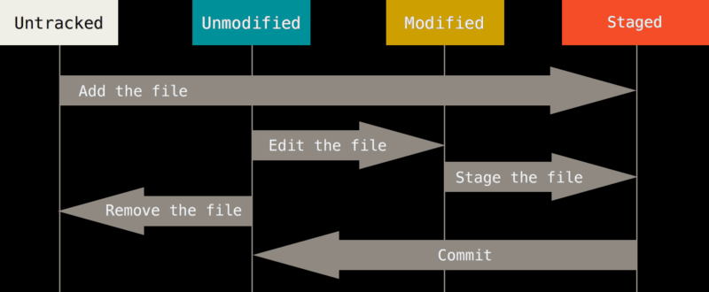

1. 检测当前文件状态

要检测文件处于哪个状态可以使用 `git status` 进行查看，对于没有任何状态的文件会放在 Untracked files 文字下；
2. 跟踪文件

我们可以通过使用 `git add 文件名/目录的路径` 的方式对新文件或者已发生修改的文件进行跟踪，命令执行后文件处于暂存状态，通过 `git status` 可以看到文件名处于 Changes to be committed 下
注：`git add` 是一个多功能的命令：1. 用于开始跟踪新文件；2. 把已经跟踪的文件放入暂存区；3. 用于合并时把有冲突的文件标记为已解决的状态；所以可以说 git add 是以内容为单位的操作而不是对于整个文件而言

3. 状态简览

使用 `git status` 命令，查看到的是十分详细的内容，而使用 `git status -s` 命令或者 `git status --short` 命令会得到一种紧凑的输出格式；  
其中 新添加未跟踪的文件前显示 ？？； 添加到暂存区的文件前面显示 A；修改过的文件前面显示 M；当 M 出现在右侧表示文件被修改了但是还没有存在于暂存区；出现在左侧表示文件被修改了并放入了暂存区；也有可能两侧都出现；

4. 忽略文件

一般我们总会有些文件无需纳入 Git 的管理，也不希望它们总出现在未跟踪文件列表。 通常都是些自动生成的文件，比如日志文件，或者编译过程中创建的临时文件等。 在这种情况下，我们可以创建一个名为 .gitignore 的文件，列出要忽略的文件模式。 来看一个实际的例子：

    ```js
        $ cat .gitignore
        *.[oa]
        *~
    ```

第一行告诉 Git 忽略所有以 .o 或 .a 结尾的文件。一般这类对象文件和存档文件都是编译过程中出现的。 第二行告诉 Git 忽略所有以波浪符（~）结尾的文件，许多文本编辑软件（比如 Emacs）都用这样的文件名保存副本。 此外，你可能还需要忽略 log，tmp 或者 pid 目录，以及自动生成的文档等等。 要养成一开始就设置好 .gitignore 文件的习惯，以免将来误提交这类无用的文件。

文件 .gitignore 的格式规范如下：

- 所有空行或者以 ＃ 开头的行都会被 Git 忽略。
- 可以使用标准的 glob 模式匹配。
- 匹配模式可以以（/）开头防止递归。
- 匹配模式可以以（/）结尾指定目录。
- 要忽略指定模式以外的文件或目录，可以在模式前加上惊叹号（!）取反。

所谓的 glob 模式是指 shell 所使用的简化了的正则表达式。 星号（\*）匹配零个或多个任意字符；[abc] 匹配任何一个列在方括号中的字符（这个例子要么匹配一个 a，要么匹配一个 b，要么匹配一个 c）；问号（?）只匹配一个任意字符；如果在方括号中使用短划线分隔两个字符，表示所有在这两个字符范围内的都可以匹配（比如 [0-9] 表示匹配所有 0 到 9 的数字）。 使用两个星号（*) 表示匹配任意中间目录，比如`a/**/z` 可以匹配 `a/z, a/b/z` 或 `a/b/c/z`等。

GitHub 有一个十分详细的针对数十种项目及语言的 .gitignore 文件列表，你可以在 [GitHub-ignore](https://github.com/github/gitignore) 找到它.

5. 查看以暂存和为暂存的信息
    通过 `git status` 仅仅是查看那些文件进行了修改，如果需要查看那些地方发生了修改，就需要使用另一个命令 `git diff`;
    `git diff` -- 显示哪些地方发生了修改，但是还没有进行缓存(是通过对比本地文件和暂存区快照实现的)；
    如果希望查看哪些部分已经暂存但是还没有提交，可以通过 `git diff --cached` 或者 `git diff --staged` 进行查看

6. 提交更新
    存放在暂存区的文件已经可以顺利提交了，建议在提交之前使用 `git status` 查看一下暂存区中是否遗漏一些本地文件；
    使用命令 `git commit` 进行提交；
    如果需要在提交的时候查看本次提交具体是修改了哪些内容，需要使用命令 `git commit -v` 这样修改的内容同样会出现在编辑器中；还可以通过使用 `git commit -m "提交信息"` 的方式进行快速提交；
    提交成功后会返回下面的信息：

        ```
            [master 800770b] 日常
            1 file changed, 6 insertions(+)
        ```
    当前是在哪个分支（master）提交的，本次提交的完整 SHA-1 校验和是什么（463dc4f），以及在本次提交中，有多少文件修订过，多少行添加和删改过。

    - 注： 提交仅仅是提交暂存区的快照，在任何时候我们都可以回到这个状态，或者与这个状态进行比较；

    如果希望直接提交所有的文件，省略 `add` 命令；可以配合 `-a` 参数使用

7. 移除文件
    - 如果希望删除文件需要使用命令 `git rm`, （因为仅仅在本地进行删除，在 git 管理中依旧存在它的快照）
    - 如果要删除的文件的已经提交到暂存区了，就需要配合 `-f` 来强制删除；如果
    - 如果需要仅仅在暂存区中删除文件，而保留本地文件，需要配合 `--cached` 使用

8. 移动文件
    git 中不存在移动文件的功能，但是也提供了实现方法(针对暂存区的文件)；
    `git mv 原文件 目标文件`
    其实这一句命令相当于以下命令的集合：

        ```
            $ mv README.md README
            $ git rm README.md
            $ git add README
        ```
实际操作：
目前我们仓库中已经存在一个 git.txt 文件，现在我们对这个文件进行修改；

```txt
    这是创建的一个文本，用于测试git
    Git is good software.
    文件的第一个修改（free => good）
```

1. 使用 `git status` 查看状态；
2. 可以使用 `git diff` 查看具体的修改部分；
3. `git add git.txt`
4. 使用 `git status` 查看状态
    文件名为红色，表示文件还没有进行管理处在工作区
    文件名为绿色表示在暂存区
5. `git commit -m "change one"`
6. `git status`

- 注：
    1. `git status` 可以让我们时刻掌握仓库的当前状态；
    2. `git diff` 可以查看文件的difference的地方；
    3. 不要使用 win 下的记事本去编辑文件，会导致各种问题；

- 补上这一段命令在 git 中的表现

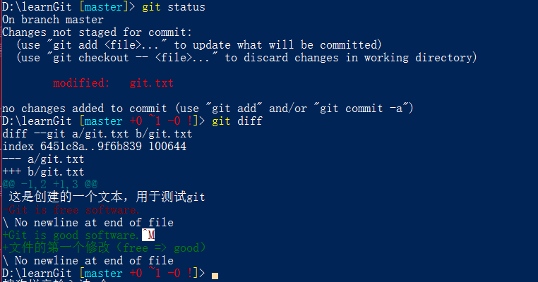;
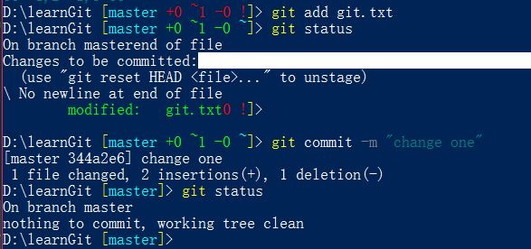;

- 注：
    1. 其中红色的文字是指修改前的文字
    2. 绿色的文字后面跟着M是指修改后的文字
    3. 绿色的文字后面没有标示的表示新增的文字
    4. 可能不同的 git 工具下表现不同，以实际表现为准

### 2.3 版本回退

我们尝试再一次修改文件

```txt
这是创建的一个文本，用于测试git
Git is good software.
文件的第一个修改（free => good）

Git is a distributed version control system
测试版本回退的时，添加的文字；
```

1. 使用 `git log` 查看版本：(16进制版本号、版本注释、操作者、时间等)
    可以查看到共有三个版本：
    1. this is a test for git
    2. change one
    3. 测试版本回退

2. 进行版本回退
    1. 在 Git 中，HEAD表示当前版本，通过 `HEAD^` 表示上一个版本，`^` 可以连续使用，不过也可以通过 `~` 的方式直接指定到上某个版本，例如：上一百可以使用 `HEAD~100`;
    2. 现在我们把当前版本回退到上一个版本 -- change one
    3. 使用 `git rest` 命令，可以进行版本回退，回退到上一个 `git rest --hard HEAD`;这是文件就已经回到了 change one 时的状态
    4. `git log` 可以看到 `测试版本回退` 这个版本已经不存在了
    5. 如果想要回退的指定版本可以使用 `git reset --hard 版本号`，例如 我们要回退到 `测试版本回退` 这个版本，首先找到这个版本的版本号，然后输入
    `git reset --hard ca75b26b336a0e` (版本号无需输全)，这时就已经还原到 `测试版本回退` 的版本状态了
    6. 如果已经找不到了版本号，可以使用 `git reflog` 查看当前仓库的每一次命令（commit 和 reset 等），在起始位置就是版本号

- 注：
    1. 如果使用 git log 发现文字太多不易观察可以使用 `git log --pretty=oneline`
    2. 使用 `cat 文件名` 可以直接输出文件内容
    3. git 是通过切换指针来修改当前指向的版本，通过修改本地文件，所以这个速度是十分快速的
    4. 如果日志很长，可以通过 q 退出；

- 补上这一段命令在 git 中的表现

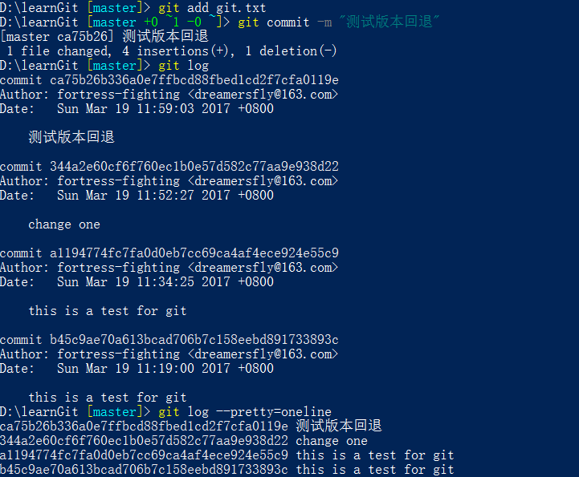;
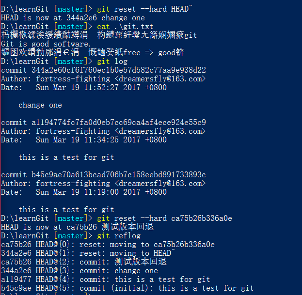;

- 注：其中 commit 就是指提交的版本号

### 2.4 工作区和暂存区

Git 和 其他版本公职系统和 SVN 的一个不同之处的就是有暂存区的概念

- 工作区
    简单的说就是电脑中能够看到的目录

- 版本库
    工作区有一个隐藏目录 `.git` ,这个目录就是 git 的版本库；
    在版本库中：
    1. 叫做 stage 的暂存区；
    2. git 为我们自动创建的第一个分支 master
    3. 指向 master 的一个指针 HEAD
    [git版本库图解](./img/版本库.jpg)

- 暂存区
     暂存区是版本库中重要的一部分；
     `git add` 就是将文件提交到暂存区
     `git commit` 就是将暂存区的所欲内容提交到当前分支（默认就是 master 分支）

- 操作：
    1. 继续修改 git.txt 并且 再添加一个文件 LICENSE；
    2. 使用 `git status` 会告诉你，有一个文件修改，一个文件还未提交；
    3. 使用 `git add .` 将两次修改提交到暂存区
    4. 使用 `git status` 再次查看状态
    5. 使用 `git commit` 将暂存区的内容一次性的提交到版本区；
    6. 使用 `git status` 查看状态

- 注：一旦提交到版本区以后，同时你的工作区没有修改，那么工作区就是干净的，并且暂存区是空的；

- 补上这一段命令在 git 中的表现

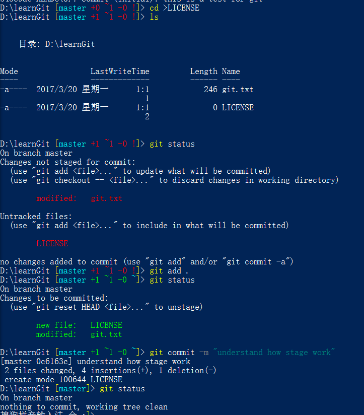;

- 注： `[master +0 ~1 -0 !]` master 代表分支，第一个数字代表工作区，第二个数字代表暂存区，第三个数字版本区；绿色，代表已存在的，红色代表修改；+ 代表新增 - 代表删除

### 2.4 管理修改

Git跟踪并管理的是修改，而非文件。

1. 修改 git.txt，在后加上：

    ```txt
        Git and change
        学习管理修改时添加
    ```
2. `git add`
3. `git status`
4. 再次修改 git.txt
5. `git commit`
6. `git status`
7. `git diff HEAD -- git.txt`

- 注：commit 只会提交暂存区的内容

- 补上这一段命令在 git 中的表现

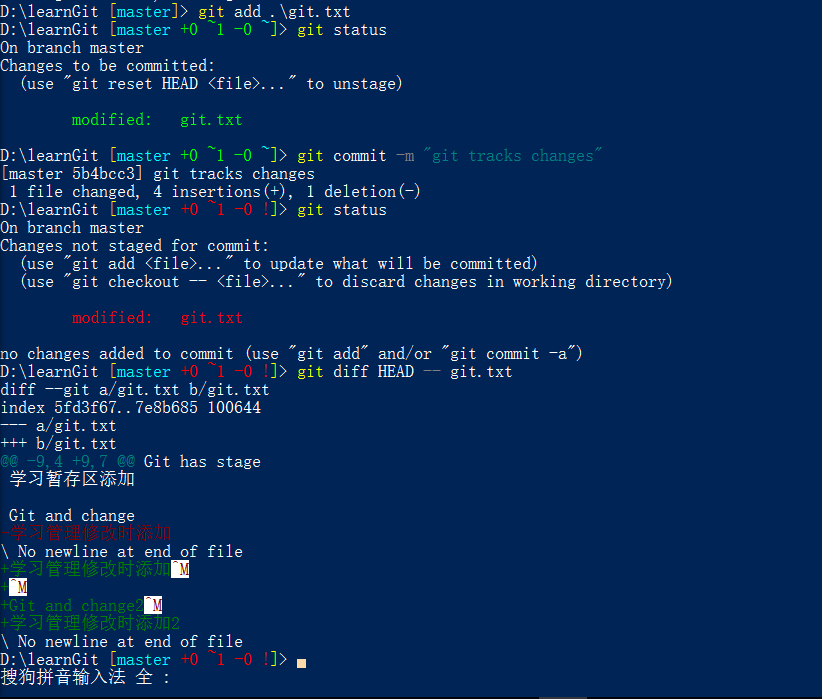;

- 注：
    查看已经暂存起来的文件(staged)和上次提交时的快照之间(HEAD)的差异
    比较暂存区和版本区：
    `git diff --cached`
    `git diff --staged`
    比较 版本1 版本2 的差异
    `git diff 版本1 版本2`
    比较两个分支的差异
    `git diff 分支`
    显示简单的差异
    `git diff --stat`

#### 2.4.1 撤销更改

当你在修改文件以后，突然发现修改错了，要撤销这次修改，但是修改的地方太多了，一点一点的撤销十分的麻烦，这时就可以使用 `git checkout -- <file>` 的方式撤销这次修改；

1. 继续修改 git.txt 添加
    ```txt
        this is a error code
        这句话需要被撤销修改
    ```
2. `git status`
    这里会有提示
3. `git checkout -- git.txt`
    这样文件就会撤销掉这一次的修改

如果，你不仅仅修改了，还将这一次修改提交到了暂存区，可以使用：

1. 继续修改 git.txt 添加
    ```txt
        this is a error code2
        这句话需要被撤销修改2
    ```
2. `git add git.txt`
3. `git status`
    同样会有提示
4. `git reset HEAD git.txt`
    这一个命令就可以将暂存区的修改撤销掉，重新放到工作区
5. `git status`
6. `git checkout -- git.txt`
    成功撤销修改

再如果你已经把暂存区的文件提交到了版本库中，可以使用 `git reset --hard <版本号>` 的方式进行回退

- 补上这一段命令在 git 中的表现

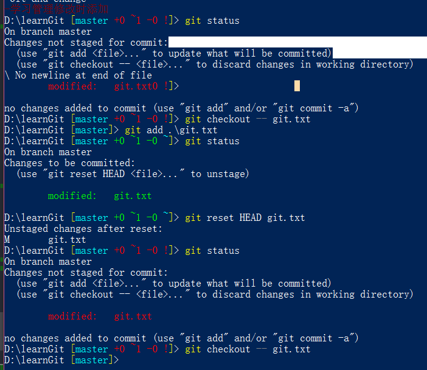;

- 注：
    如果 commit 的时候，注释写错了，可以使用
    `git commit --amend` 进行修改

#### 2.4.2 删除文件

1. 添加一个新的文件(test.txt)到 git 并且提交，
2. 这时我们将这个文件删除
    - 直接本地删除
    - 使用 rm 命令删除
    这时将会提示工作区和版本区不同了
3. `git status`
    查看提示，那些文件被删除了
4. 如果需要在版本区也删除
    - `git rm <file>`
    - `git commit`
5. 如果并不是需要删除，而是误删的话可以通过 `git checkout -- test.txt`进行恢复

- 补上这一段命令在 git 中的表现

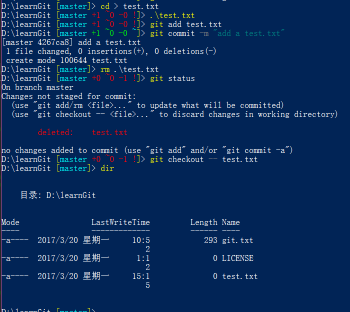;

- 注：
    `git rm -f 文件名` 可以强制删除（暂存和本地）
    `git rm --cached` 可以强制删除暂存区的文件
