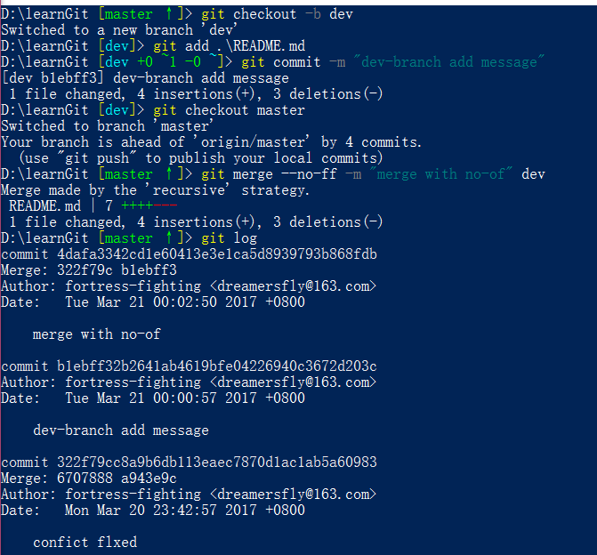

# Learn Git

下面的部分是介绍 git 如果与远程仓库配合使用

## 1 Git 与 远程仓库

这一节没什么好说的，贴上原网址：
[GitHub](http://www.liaoxuefeng.com/wiki/0013739516305929606dd18361248578c67b8067c8c017b000/001374385852170d9c7adf13c30429b9660d0eb689dd43a000)

Git 的特点是分布式管理，也就是同一个 Git 仓库，可以分到不同的机器上进行管理；这时我们就需要一个稳定的仓库为不同的机器提供一个版本库，从而方便各个机器进行克隆；

实际情况往往是这样，找一台电脑充当服务器的角色，每天24小时开机，其他每个人都从这个“服务器”仓库克隆一份到自己的电脑上，并且各自把各自的提交推送到服务器仓库里，也从服务器仓库中拉取别人的提交。

完全可以自己搭建一台运行Git的服务器，不过现阶段，为了学Git先搭个服务器绝对是小题大作。好在这个世界上有个叫GitHub的神奇的网站，从名字就可以看出，这个网站就是提供Git仓库托管服务的，所以，只要注册一个GitHub账号，就可以免费获得Git远程仓库。

### 1.1 使用 GitHub 创建远程仓库

在继续阅读后续内容前，请自行注册GitHub账号。由于你的本地Git仓库和GitHub仓库之间的传输是通过SSH加密的，所以，需要一点设置：

第1步：创建SSH Key。在用户主目录下，看看有没有.ssh目录，如果有，再看看这个目录下有没有`id_rsa`和`id_rsa.pub`这两个文件，如果已经有了，可直接跳到下一步。如果没有，打开Shell（Windows下打开Git Bash），创建SSH Key：

`$ ssh-keygen -t rsa -C "youremail@example.com"`
你需要把邮件地址换成你自己的邮件地址，然后一路回车，使用默认值即可，由于这个Key也不是用于军事目的，所以也无需设置密码。

如果一切顺利的话，可以在用户主目录里找到.ssh目录，里面有`id_rsa`和`id_rsa.pub`两个文件，这两个就是SSH Key的秘钥对，`id_rsa`是私钥，不能泄露出去，`id_rsa.pub`是公钥，可以放心地告诉任何人。

第2步：登陆GitHub，打开“Account settings”，“SSH Keys”页面：

然后，点“Add SSH Key”，填上任意Title，在Key文本框里粘贴id_rsa.pub文件的内容：

`github-addkey-1`

点“Add Key”，你就应该看到已经添加的Key：

`github-addkey-2`

为什么GitHub需要SSH Key呢？因为GitHub需要识别出你推送的提交确实是你推送的，而不是别人冒充的，而Git支持SSH协议，所以，GitHub只要知道了你的公钥，就可以确认只有你自己才能推送。

当然，GitHub允许你添加多个Key。假定你有若干电脑，你一会儿在公司提交，一会儿在家里提交，只要把每台电脑的Key都添加到GitHub，就可以在每台电脑上往GitHub推送了。

最后友情提示，在GitHub上免费托管的Git仓库，任何人都可以看到喔（但只有你自己才能改）。所以，不要把敏感信息放进去。

如果你不想让别人看到Git库，有两个办法，一个是交点保护费，让GitHub把公开的仓库变成私有的，这样别人就看不见了（不可读更不可写）。另一个办法是自己动手，搭一个Git服务器，因为是你自己的Git服务器，所以别人也是看不见的。这个方法我们后面会讲到的，相当简单，公司内部开发必备。

确保你拥有一个GitHub账号后，我们就即将开始远程仓库的学习。

### 1.2 添加远程库

这一节很重要，但是整体很简单，这里就简单的说一说；
贴上网址：
[添加远程库-廖雪峰](http://www.liaoxuefeng.com/wiki/0013739516305929606dd18361248578c67b8067c8c017b000/0013752340242354807e192f02a44359908df8a5643103a000)

1. 创建仓库
2. 使用远程仓库
    有两种方式可以使用 GitHub 的远程仓库
    - 使用 git clone 将仓库下载到本地进行管理
        `git clone <http>` http可以在仓库下载的地方找到；
    - 将本地仓库与远程仓库管理起来
        `git remote add origin <ssh>` ssh可以在仓库下载的地方找到；
        `git push -u origin master` 将本地仓库关联到远程仓库并提交到本地文件提交到远程仓库
        这里遇到的许多问题不知道是否是个例大致说下：
        就是提示已经存在一个master分支导致不能提交，然后提示 pull 一些，但是 pull 的时候又发生别的错误；
        解决方式
        ```txt
            git config branch.master.remote origin
            git config branch.master.merge refs/heads/master
        ```
        这两句是配置 config 的命令意思是：
        - 当你处于master branch, 默认的remote就是origin。
        - 当你在master branch上使用git pull时，没有指定remote和branch，那么git就会采用默认的remote（也就是origin）来merge在master branch上所有的改变
        然后继续 `git pull` 还是报错
        然后继续提交 `git push` 还是报错。。。
        然后强制提交 `git push -f` --成功，但是覆盖掉远程库

如果存在其他问题，可以参考上面的链接，解决不掉就自行解决

## 2. 分支管理

假设你准备开发一个新功能，但是需要两周才能完成，第一周你写了50%的代码，如果立刻提交，由于代码还没写完，不完整的代码库会导致别人不能干活了。如果等代码全部写完再一次提交，又存在丢失每天进度的巨大风险。

现在有了分支，就不用怕了。你创建了一个属于你自己的分支，别人看不到，还继续在原来的分支上正常工作，而你在自己的分支上干活，想提交就提交，直到开发完毕后，再一次性合并到原来的分支上，这样，既安全，又不影响别人工作。

### 2.1 创建与合并分支

关于分支的理解这里解释的十分充分：
[廖雪峰-创建与合并分支](http://www.liaoxuefeng.com/wiki/0013739516305929606dd18361248578c67b8067c8c017b000/001375840038939c291467cc7c747b1810aab2fb8863508000)

简单的说一下：
在 git 中，把每一次提交都穿成一条时间线，而初始的时候的时间线又叫做主分支--master，而 HEAD 就是指向当前分针的指针，我们可以在主分支上创建一个子分支，这个使用 HEAD 就会指向当前分支，而 master 的时间线就会暂停，子分支可以提交从而开启新的时间线，当完成修改的时候可以将子分支和主分支的内容合并，这样就回到了 master的时间线，可以继续提交；而子分支没有合并前的信息相对独立，不会影响到主分支；

1. 首先创建分支：`git checkout -b dev`
    `git checkout -b` 是创建并切换分支的命令
    相当于：`git branch dev` 和 `git checkout dev`
2. `git branch`
    查看分支，当前分支前存在 * 号
3. 我们在当前库中进行修改,并提交
    新增一个 README.md
    `git add .`
    `git commit -m  "branch--dev add a readme"`
4. 分支完成工作，我们切换到主分支 `git checkout master`
    这时修改的行为还停留在子分支 dev 上，HEAD 指向master分支
5. `git merge dev`
    将 dev 分支和当前分支合并
6. `git branch -d dev`
    如果需要就可以删除 dev 分支
7. `git branch`
    查看

- 补上这一段命令在 git 中的表现

;

### 2.2 解决冲突

当进行分支合并的时候，两个分支上都对一个文件产生了修改，这个时候就会出现冲突

1. `git checkout -b featurel`
    - 在 README 中随便写一写；
2. `git add README.md`
3. `git commit -m "write someting in readme"`
4. `git checkout master`
    这时会提示，本地的 master 分支比远程的分支要超前一个提交；
    切回到 master 的时候，文件的内容也会还原到 master 时间线；
5. 修改 README 文件，然后提交到版本库
    `git commit -m "master write someting in readme"`
    这时两个分支都有了自己的提交，这个时候进行合并的时候就会存在冲突
6. `git merge featurel`
    这时 Git 就会提示：Merge conflict in README.md 必须手动解决
7. `git status` -- 也可以查看到冲突
8. 这时我们打开 README 可以查看内容：
    ```txt
    <<<<<<< HEAD
    # Git
    =======
    # 学习 Git

    ## 参考

    廖雪峰--git
    >>>>>>> featurel
    ```
    其中 HEAD 表示当前分支的，以 ====== 为分界，下面的是 featurel 分支上的
9. 修改这个文件冲突的部分，然后提交
10. 使用 `git log --graph --pretty=oneline --abbrev-commit` 可以查看这次修改时版本的变化
11. `git checkout -d featurel`

- 补上这一段命令在 git 中的表现

;
;

### 2.3 分支管理策略

git 合并的时候默认使用的是 `Fast forward` 模式，但是在这种模式下，如果分支被删除了，不会存在任何记录；
可以通过 `--on-ff` 参数禁止 `Fast forward` 模式，这时在 merge 的时候，就会生成一个新的 commit，并记录分支的提交信息

1. `git checkout -b dev`
2. 修改 README，并提交
3. `git checkout master`
4. `git merge --no-ff -m "merge with no-of" dev`
    使用参数禁止掉 `Fast forward`，由于这次会保存一次提交信息所以要添加 `-m`

- 补上这一段命令在 git 中的表现

;

- 补：
    分支策略：
    在实际开发中，我们应该按照几个基本原则进行分支管理：

    首先，master分支应该是非常稳定的，也就是仅用来发布新版本，平时不能在上面干活；

    那在哪干活呢？干活都在dev分支上，也就是说，dev分支是不稳定的，到某个时候，比如1.0版本发布时，再把dev分支合并到master上，在master分支发布1.0版本；

    你和你的小伙伴们每个人都在dev分支上干活，每个人都有自己的分支，时不时地往dev分支上合并就可以了。

    所以，团队合作的分支看起来就像这样：

    

### 2.4 Bug 分支

当在需要修复一个 bug 的时候，可以为这个 bug 创建一个分支，进行修复，修复完成后在合并；但是存在一个问题，如果在一个分支下需要修改一个 bug，但是当前操作还没有完成，当前分支还不能提交，这时需要使用 `git stash` 将当前分支暂时的储存起来，然后去修改 bug 所在的分支；

1. 创建 dev 分支
2. 修改 README
    添加 这是一个bug
3. `git checkout -b page`
    代表正在处理的分支
4. 对 README 进行修改
    这个是一个分支的修改
5. `git stash`
    这个命令将当前分支储存了起来，这个时候分支的状态是干净的
6. 找到 bug 所在分支，创建 issue 分支
    `git checkout dev`
    `git checkout -b issue-101`
7. 修改 bug，然后提交
    - 删除 这是一个bug
8. 切到 bug 所在分支，然后 merge 最后删除 issue 分支
9. 切到原本工作的分支
10. `git stash list`
    查看保存的信息
11. `git stash pop`
    相当于 `git statsh apply` -- 恢复 + `git statsh drop` -- 删除;
    然后就会回到工作时的状态继续工作

- 注：
    可以使用 `git stash` 保存多次，然后通过 `git stash list` 查看，然后使用 `git stash apply stash@{<num>}`的形式进行恢复

- 补上这一段命令在 git 中的表现

;
;

### 2.5 Feature 分支

我们删除 dev 和 page 分支，继续学习

在开发的过程中，会遇到一些情况，比如说一些功能可能需要添加，这种情况是一个实验性的（可能使用也可能不使用），我们可能就不想直接在主分支上进行添加，因为这样会导致混乱。比较好的就是创建一个 Feature 分支，去管理

1. `git checkout -b Feature`
    在 README 中添加这是一个计划文字
2. 提交
3. `git checkout master`
4. 合并前，接到通知这个修改方案取消了
5. `git branch -d Feature`
    提示删除不掉
6. `git branch -D Feature`
    强制删除

### 2.6 多人协作

[廖雪峰-多人协作](http://www.liaoxuefeng.com/wiki/0013739516305929606dd18361248578c67b8067c8c017b000/0013760174128707b935b0be6fc4fc6ace66c4f15618f8d000)

当你从远程仓库克隆时，实际上Git自动把本地的master分支和远程的master分支对应起来了，并且，远程仓库的默认名称是origin。

要查看远程库的信息，用 `git remote`
或者，用 `git remote -v` 显示更详细的信息：

```txt
git remote -v
origin  git@github.com:michaelliao/learngit.git (fetch)
origin  git@github.com:michaelliao/learngit.git (push)
```

上面显示了可以抓取和推送的origin的地址。如果没有推送权限，就看不到push的地址。

#### 2.6.1 推送分支

推送分支，就是把该分支上的所有本地提交推送到远程库。推送时，要指定本地分支，这样，Git就会把该分支推送到远程库对应的远程分支上：

`git push origin master`如果要推送其他分支，比如dev，就改成：`git push origin dev`

但是，并不是一定要把本地分支往远程推送，那么，哪些分支需要推送，哪些不需要呢？

- master分支是主分支，因此要时刻与远程同步；
- dev分支是开发分支，团队所有成员都需要在上面工作，所以也需要与远程同步；
- bug分支只用于在本地修复bug，就没必要推到远程了，除非老板要看看你每周到底修复了几个bug；
- feature分支是否推到远程，取决于你是否和你的小伙伴合作在上面开发。

总之，就是在Git中，分支完全可以在本地自己藏着玩，是否推送，视你的心情而定！

#### 2.6.2 抓取分支

多人协作时，大家都会往master和dev分支上推送各自的修改。

当克隆的时候，仅仅会克隆 master 分支；

假设 A clone 仓库，然后创建 dev 分支，开始工作，并时不时的提交到远程仓库`git push origin dev`；这是 B 工作也结束了，也开始提交，这个时候就会失败，同时提示你，已经存在 dev 分支了，并且这个分支和你的还不一样

解决方式：

1. `git pull` 后然后在本地合并，解决冲突后提交
    `git pull` = `git fetch` -- 拉下来 + `git merge`
2. 如果 `git pull` 失败了，可能是因为没有指定本地 dev 和远程 origin/dev 的链接，
    - `git branch --set-upstream dev origin/dev`
    - 继续 pull
    - 解决冲突，再 push

- 注：
    因此，多人协作的工作模式通常是这样：

    1. 首先，可以试图用git push origin branch-name推送自己的修改；
    2. 如果推送失败，则因为远程分支比你的本地更新，需要先用git pull试图合并；
    3. 如果合并有冲突，则解决冲突，并在本地提交；
    4. 没有冲突或者解决掉冲突后，再用git push origin branch-name推送就能成功！
    5. 如果git pull提示“no tracking information”，则说明本地分支和远程分支的链接关系没有创建，用命令git branch --set-upstream branch-name origin/branch-name。

    这就是多人协作的工作模式，一旦熟悉了，就非常简单

## 3 Git 标签管理

Git 的版本号不利于管理，如果有 tag 就会十分方便

1. 切换到需要打标签的分支上
2. `git tag <name>`
    打标签
3. `git tag`
    查看所有标签

- 如果要对某个版本进行补打
    1. 找到历史提交的版本号 `git log --pretty=oneline --abbrev-commit`
    2. `git tag <name> <commit ID>`
    3. `git tag`
        查看
    4. `git show <tagname>`
        查看标签的详细信息
    5. 可以创建带有说明的标签
        `-a` -- 指定标签名
        `-m` -- 指定说明文件
        例如：`git tag -a v0.1 -m "this is a project for git" b45c9ae`
- 如果标签打错了，也可以删除
    `git tag -d <tagname>`
    因为在创建的标签都只储存在本地，不会自动推送到远程，所以的标签可以在本地安全删除
- 可以将某个标签推送到远程
    `git push origin <tagname>` -- 推送一个标签
    `git push origin --tags` -- 推送所有标签
- 推送到远程后的删除方式：
    `git tag -d <tagname>` -- 删除本地的 tagname
    `git push origin :refs/tags/v0.9` -- 删除标签

- 补上这一段命令在 git 中的表现

;
;

## 4 使用 GitHub

如果希望能参与一个项目，可以在项目下点击 `Fork` 这就在自己的账户下克隆一个项目，然后 clone 到本地，进行管理，如果希望对一个项目提交一个 issue，可以点击 pull request

## 5 自定义 Git

`git config --global color.ui true`  -- 让 git 显示颜色；

### 5.1 忽略特殊文件

如果需要在工作区忽略一些文件：

1. 在 Git 的工作区的根目录下创建一个文件 -- .gitignore
2. 将要忽略的文件名填进去， Git 就会自动忽略这些文件

一般不需要从头写.gitignore文件，GitHub已经为我们准备了各种配置文件，只需要组合一下就可以使用了。所有配置文件可以直接在线浏览：
[gitignore-配置](https://github.com/github/gitignore)

- 忽略文件的原则是：
    1. 忽略操作系统自动生成的文件，比如缩略图等；
    2. 忽略编译生成的中间文件、可执行文件等，也就是如果一个文件是通过另一个文件自动生成的，那自动生成的文件就没必要放进版本库，比如Java编译产生的.class文件；
    3. 忽略你自己的带有敏感信息的配置文件，比如存放口令的配置文件。

- 忽略方法
    1. 忽略单个文件 -- 直接写文件名带后缀 `git.txt`
    2. 忽略一类文件 -- `*.txt`/`*.ab[cde]`
    3. 忽略文件夹名 -- 直接写文件夹名

- 注：
    1. 如果要添加的文件被忽略了可以使用 `git add -f git.txt` 的方式强制添加；
    2. `git check-ignore -v git.txt` 查找对应的规则

### 5.2 配置别名

在使用的过程中，会遇到有些命令较长，这是我们就可以为这条命令添加一个配置别名去简化输入

1. `git config --global alias.<simple> "<order>"`
    - 通过 config 我们可以知道这个命令是编辑 config 使用的，在config文件中的alias就是添加的配置，可以在这里删除；
    - --global 是代表这个命令是对全局使用的，如果不加就仅仅对当前仓库使用
2. 举例：
    `git log --pretty=oneline --abbrev-commit` => `git logone`
    输入
    `git config --global alias.logone "log --pretty=oneline --abbrev-commit"`
    使用
    `git logone`

```txt
git config --global alias.lg "log --color --graph --pretty=format:'%Cred%h%Creset -%C(yellow)%d%Creset %s %Cgreen(%cr) %C(bold blue)<%an>%Creset' --abbrev-commit"
```

### 5.3 配置git服务器

[廖雪峰--配置git](http://www.liaoxuefeng.com/wiki/0013739516305929606dd18361248578c67b8067c8c017b000/00137583770360579bc4b458f044ce7afed3df579123eca000)

没地用，暂不了解

## 6 其他

git 还有许许多多的命令没有介绍到，需要不断学习

附上一些链接：

1. [Git Cheat Sheet](https://pan.baidu.com/s/1kU5OCOB#list/path=%2F)
2. [git 官网](http://git-scm.com)
