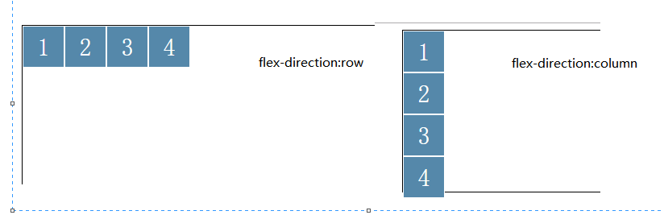
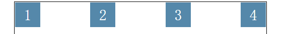

# 弹性盒模型

如果没有特殊声明，结构就以此为模板：
```
<!DOCTYPE html>
<html lang="en">
<head>
    <meta charset="UTF-8">
    <title>Document</title>
    <style>
        #box {
            width: 500px;
            margin: auto;
            height: 200px;
            border: 1px solid black;
        }
        #box div {
            width: 50px;
            height: 50px;
            border: 1px solid #fff;
            font-size: 30px;
            line-height: 50px;
            text-align: center;
            background: #58a;
            color: #fff;
        }
    </style>
</head>
<body>
    <div id="box">
        <div>1</div>
        <div>2</div>
        <div>3</div>
        <div>4</div>
    </div>
</body>
</html>
```


## 1. 弹性盒模型有新旧两种

display: flex || display: -webkit-box;

会使内部元素并排排列

```
    #box {
        /*display: -webkit-box;*/
        display: flex;
    }
```


注：
在移动端中部分系统不支持新版，老版的支持性好，一般在移动端中，同时写下两种，老版写在上面而新版写在下面；
<<<<<<< HEAD
新版的弹性盒模型可以自动换行，而老版的不可以
=======
>>>>>>> origin/master

### 1.1 设置主轴方向（设置在父级上）


新版：

`flex-direction: row || column`

```
    #box {
        display: flex;
        /*flex-direction: row;*/
        flex-direction: column;
    }
```

默认: row;


老版：

`-webkit-box-orient: horizontal || vertical`

```
    #box {
        display: -webkit-box;
       /* -webkit-box-orient: horizontal; */
        -webkit-box-orient: vertical;
    }
```


### 1.2 元素的排列顺序（设置在父级上）

新版：

`flex-direction: row-reverse || column-reverse`

row-reverse


column-reverse


老版：

```
-webkit-box-orient: horizontal || vertical;
-webkit-box-direction: reverse || normal;
```

vertical 和 reverse


horizontal 和 reverse
!要注意：这里和新版的不同


### 1.3 主轴方向的富裕空间的管理（设置在父级上）

新：
justify-content: flex-start || flex-end || center || space-between || space-round

```
    #box {
       display: flex;
       justify-content: flex-start;
    }
```

flex-start 富裕空间存在内容右侧
flex-end 富裕空间存在内容左侧
center 富裕空间存在内容两侧
space-between 富裕空间平均分布在内容之间
space-around 富裕空间分布在元素两侧

flex-start

flex-end

center

space-between

space-around


老版：

`-webkit-box-pack: start || end || center || justify`

start:

end:

center:

justify:


### 1.4 侧轴方向的富裕空间的管理（设置在父级上）

新版：
`align-items: flex-start || flex-end || center || baseline`

flex-start:


flex-end:


center:


baseline:


老版：
`-webkit-box-align: start || end || center`

### 1.5 弹性空间 (设置在子级)

使弹性盒模型下的元素，按照比例分父级的宽度，内修改元素原有尺寸，这里的分配会受到元素本身宽度影响，如果元素的宽度不同，则会按照宽度的比例分配。所以如果想要确保效果，最好将每一个子元素的宽度设置一致，由于会改变宽度，所以即使设置width：0也是可以的；


新版：
`flex-grow: (num)`

```
    #box div:nth-child(1) {
        width: 300px;
        flex-grow: 1;
    }
    #box div:nth-child(2) {
        width: 400px;
        flex-grow: 2;
    }
    #box div:nth-child(3) {
        width: 100px;

        flex-grow: 3;
    }
    #box div:nth-child(4) {
        width: 150px;
        flex-grow: 4;
    }
```


```
    #box {
        display: -webkit-box;
    }
    #box div:nth-child(1) {
        flex-grow: 1;
    }
    #box div:nth-child(2) {
        flex-grow: 2;
    }
    #box div:nth-child(3) {
        flex-grow: 3;
    }
    #box div:nth-child(4) {
        flex-grow: 4;
    }
```


老版：

```
    -webkit-box-flex:(num)
```

具体使用和新版的相同，不做介绍；

### 1.6 弹性盒模型中元素具体位置设置 (设置在子级)

新版：
`order: (num)`

num 设置元素的排列位置，可以接受一个负数，越小越靠前；

```
    #box {
        display: flex;
        align-items: center;
    }
    #box div:nth-child(1) {
        order: 2;
        flex-grow: 1;
    }
    #box div:nth-child(2) {
        order: -1;
        flex-grow: 2;
    }
    #box div:nth-child(3) {
        order: 10;
        flex-grow: 3;
    }
    #box div:nth-child(4) {
        order: 5;
        flex-grow: 4;
    }
```

老版：
`-webkit-box-oridnal-group: (num)`

老版 0 及以下会被识别成1;

```
        #box {
            display: -webkit-box;
            -webkit-box-align: center;  
        }
        #box div:nth-child(1) {
            -webkit-box-ordinal-group: 4;
            -webkit-box-flex: 1;
        }
        #box div:nth-child(2) {
            -webkit-box-ordinal-group: 1;
            -webkit-box-flex: 2;
        }
        #box div:nth-child(3) {
            -webkit-box-ordinal-group: 10;
            -webkit-box-flex: 3;
        }
        #box div:nth-child(4) {
            -webkit-box-ordinal-group: 5;
            -webkit-box-flex: 4;
        }
```

