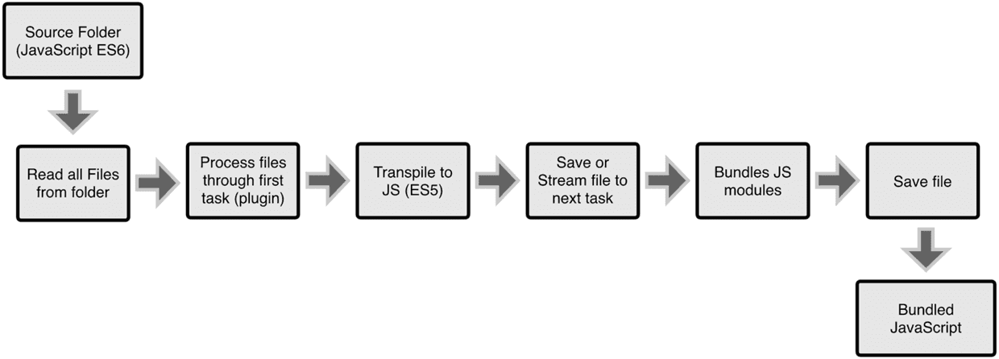
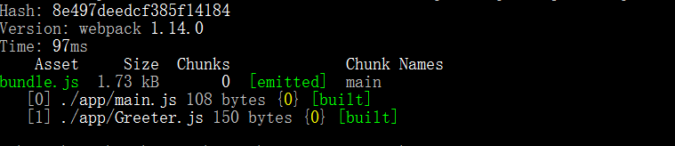

# noteForWebPack

阅读：入门Webpack，看这篇就够了
链接：http://www.jianshu.com/p/42e11515c10f#
时间：2017:01:22
这里是我自己的理解，如果存在错误，还望大家多多指正。

## 1 webpack 基础

### 1.1 什么是webpack

要了解webpack，首先要了解模块化，目前很多的网页都是功能的丰富应用，许多功能的实现往往需要依赖很多文件，为了简便开发就提出了模块化的概念（将一个复杂的程序细化为几个小的文件）；
但是模块化的文件又不能直接被浏览器所识别，需要经过额外的处理才行，而由个人去处理这些行为是十分的繁琐的，所以出现了webpack这类工具。

webpack 可以称为 模块打包工具，通过分析你的项目结构，找到浏览器不能直接使用的模块，然后处理成为合适的格式，以供浏览器使用；

### 1.2 WebPack、Gulp 以及 Grunt  

1) 区别
其实Webpack和另外两个并没有太多的可比性，Gulp/Grunt是一种能够优化前端的开发流程的工具，而WebPack是一种模块化的解决方案，不过Webpack的优点使得Webpack可以替代Gulp/Grunt类的工具。

2) 工作方式

1. Gulp || Grunt 的工作流程



上图是以 ES6=>ES5 为例：
文件目录 => 读取文件目录下的所有文件 => 通过第一个插件去处理文件 => ES6转换成ES5 => 保存或者将当前处理后的文件交给下一个插件处理 => 打包js模块 => 保存文件 => 得到结果
（英语渣渣，仅供参考）

2. WebPack 的工作流程

Webpack的工作方式是：把你的项目当做一个整体，通过一个给定的主文件（如：index.js），Webpack将从这个文件开始找到你的项目的所有依赖文件，使用loaders处理它们，最后打包为一个浏览器可识别的JavaScript文件。


>注: WebPack 的优点：Webpack的处理速度更快更直接，能打包更多不同类型的文件。

## 2 开始使用WebPack

### 2.1 安装

全局安装`npm install webpack -g webpack`

webpack可以使用npm安装，新建一个空的练习文件夹（此处命名为webpack sample progect），在终端中转到该文件夹后执行下述指令就可以完成安装。


### 2.2 创建说明文件
使用 `npm init` 快速搭建`package.json`文件

在上述练习文件夹中创建一个package.json文件，这是一个标准的npm说明文件，里面蕴含了丰富的信息，包括当前项目的依赖模块，自定义的脚本任务等等。
输入这个命令后，终端会问你一系列诸如项目名称，项目描述，作者等信息，不过不用担心，如果你不准备在npm中发布你的模块，这些问题的答案都不重要，回车默认即可。
最终的到package.json 如下：
```
{
  "name": "webpackproject",
  "version": "1.0.0",
  "description": "",
  "main": "index.js",
  "dependencies": {
    "webpack": "^1.14.0"
  },
  "devDependencies": {},
  "scripts": {
    "test": "echo \"Error: no test specified\" && exit 1"
  },
  "author": "",
  "license": "ISC"
}
```

我们在本项目中安装Webpack作为依赖包

3. 安装到你的项目目录npm install webpack --save-dev

```
"devDependencies": {
  "webpack": "^1.14.0"
},
```

>注：
1. 项目名称必须小写


### 2.3 搭建项目文件夹

回到之前的空文件夹，并在里面创建两个文件夹,
1. app文件夹 -- 用来存放原始数据和我们将写的JavaScript模块
2. public文件夹 -- 用来存放准备给浏览器读取的数据（包括使用webpack生成的打包后的js文件以及一个index.html文件）

在app文件夹中创建两个文件 （Greeter.js和main.js）放在app文件夹中
在public文件夹中创建index.html 文件

index.html文件只有最基础的html代码，它唯一的目的就是加载打包后的js文件（bundle.js）

```
<!DOCTYPE html>
<html lang="en">
  <head>
    <meta charset="utf-8">
    <title>Webpack Sample Project</title>
  </head>
  <body>
    <div id='root'>
    </div>
    <script src="bundle.js"></script>
  </body>
</html>
```

Greeter.js只包括一个用来返回包含问候信息的html元素的函数。

```
// Greeter.js
module.exports = function() {
  var greet = document.createElement('div');
  greet.textContent = "Hi there and greetings!";
  return greet;
};
```

main.js用来把Greeter模块返回的节点插入页面。

```
//main.js
var greeter = require('./Greeter.js');
document.getElementById('root').appendChild(greeter());
```

### 2.4 打包

1) 方法一：使用终端命令

webpack可以在终端中使用，其最基础的命令是
`webpack {entry file/入口文件} {destination for bundled file/存放bundle.js的地方}`
只需要指定一个入口文件，webpack将自动识别项目所依赖的其它文件，不过需要注意的是如果你的webpack没有进行全局安装，那么当你在终端中使用此命令时，需要额外指定其在node_modules中的地址，继续上面的例子，在终端中属于如下命令

```
//webpack非全局安装的情况
node_modules/.bin/webpack app/main.js public/bundle.js
```
不过这种方法是在是特别繁琐，所以可以使用下面一种方法：

2) 方法二：通过配置文件来使用Webpack

Webpack拥有很多其它的比较高级的功能（比如说本文后面会介绍的loaders和plugins），这些功能其实都可以通过命令行模式实现，但是正如已经提到的，这样不太方便且容易出错的，一个更好的办法是定义一个配置文件，这个配置文件其实也是一个简单的JavaScript模块，可以把所有的与构建相关的信息放在里面。

还是继续上面的例子来说明如何写这个配置文件，在当前练习文件夹的根目录下新建一个名为webpack.config.js的文件，并在其中进行最最简单的配置，如下所示，它包含入口文件路径和存放打包后文件的地方的路径。
```
module.exports = {
  entry:  __dirname + "/app/main.js",//已多次提及的唯一入口文件
  output: {
    path: __dirname + "/public",//打包后的文件存放的地方
    filename: "bundle.js"//打包后输出文件的文件名
  }
}
```
>exports -> 模块的输出
entry -> 入口文件路径
path -> 输出文件的存放路径
filename -> 输出文件的文件名
\_\_dirname -> 当前脚本路径

现在如果你需要打包文件只需要在终端里你运行webpack
(   全局的话可以直接使用 webpack 就可以运行
    非全局安装需使用 node_modules/.bin/webpack)
命令就可以了，这条命令会自动参考webpack.config.js文件中的配置选项打包你的项；

如果你是非全局安装的webpack，又不想使用 `node_modules/.bin/webpack` 可以通过npm引导任务运行；对其进行配置后可以使用简单的npm start命令来代替这些繁琐的命令。在package.json中对npm的脚本部分进行相关设置即可，设置方法如下。

```
"scripts": {
   "start": "webpack" //配置的地方就是这里啦，相当于把npm的start命令指向webpack命令
 },
```

npm的start是一个特殊的脚本名称，它的特殊性表现在，在命令行中使用npm start就可以执行相关命令，如果对应的此脚本名称不是start，想要在命令行中运行时，需要这样用npm run {script name}如npm run build，以下是执行npm start后命令行的输出显示

>注：package.json中的脚本部分已经默认在命令前添加了node_modules/.bin路径，所以无论是全局还是局部安装的Webpack，你都不需要写前面那指明详细的路径了。

执行后会显示：



## 3 Webpack的强大功能

### 3.1 生成SourceMaps


m
