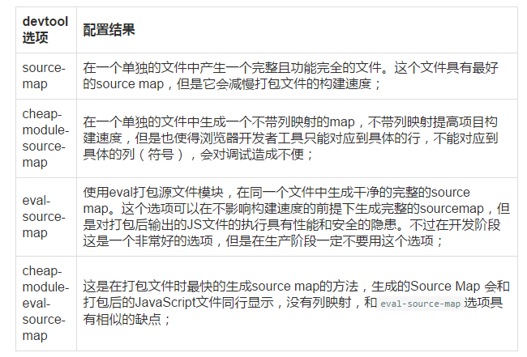
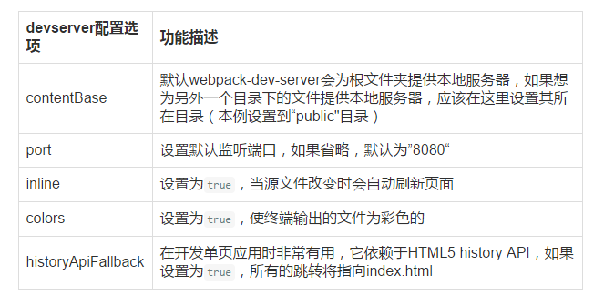

## 3 Webpack的强大功能

### 3.1 生成SourceMaps

开发总是离不开调试，如果可以更加方便的调试当然就能提高开发效率，不过打包后的文件有时候你是不容易找到出错了的地方对应的源代码的位置的，Source Maps就是来帮我们解决这个问题的。
通过简单的配置后，Webpack在打包时可以为我们生成的source maps，这为我们提供了一种对应编译文件和源文件的方法，使得编译后的代码可读性更高，也更容易调试。

在webpack的配置文件中配置source maps，需要配置devtool，它有以下四种不同的配置选项，各具优缺点，描述如下：



正如上表所述，上述选项由上到下打包速度越来越快，不过同时也具有越来越多的负面作用，较快的构建速度的后果就是对打包后的文件的的执行有一定影响。

在学习阶段以及在小到中性的项目上，eval-source-map是一个很好的选项，不过记得只在开发阶段使用它，继续上面的例子，进行如下配置

```
module.exports = {
  devtool: 'eval-source-map',//配置生成Source Maps，选择合适的选项
  entry:  __dirname + "/app/main.js",
  output: {
    path: __dirname + "/public",
    filename: "bundle.js"
  }
}
```
>注：会在bundle.js中存在提示

cheap-module-eval-source-map方法构建速度更快，但是不利于调试，推荐在大型项目考虑da时间成本是使用。

### 3.2 使用webpack构建本地服务器

想不想让你的浏览器监测你都代码的修改，并自动刷新修改后的结果，其实Webpack提供一个可选的本地开发服务器，这个本地服务器基于node.js构建，可以实现你想要的这些功能，不过它是一个单独的组件，在webpack中进行配置之前需要单独安装它作为项目依赖

devserver作为webpack配置选项中的一项，具有以下配置选项



继续把这些命令加到webpack的配置文件中，现在的配置文件如下所示

```
module.exports = {
  devtool: 'eval-source-map',

  entry:  __dirname + "/app/main.js",
  output: {
    path: __dirname + "/public",
    filename: "bundle.js"
  },

  devServer: {
    contentBase: "./public",//本地服务器所加载的页面所在的目录
    colors: true,//终端中输出结果为彩色
    historyApiFallback: true,//不跳转
    inline: true//实时刷新
  }
}
```

### 3.2 Loaders
