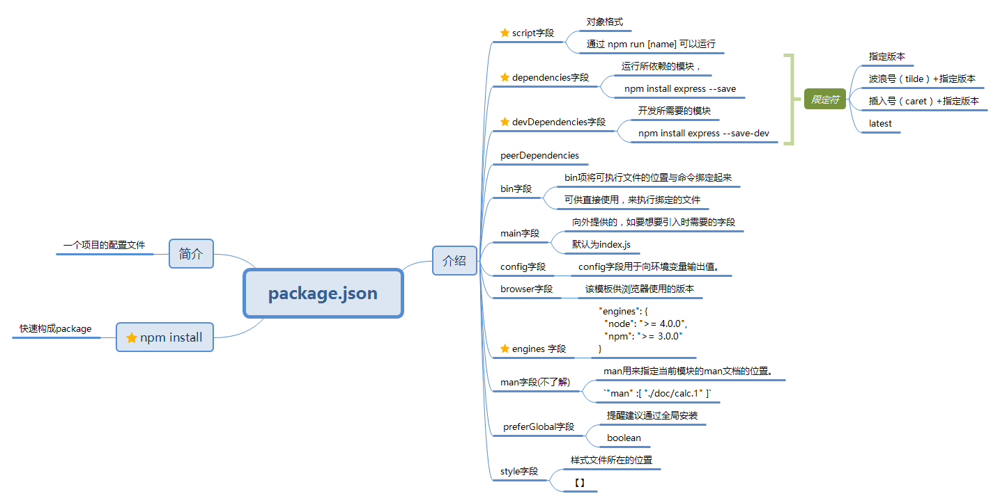

# Learn NPM

原网址：http://javascript.ruanyifeng.com/nodejs/packagejson.html#toc0
原作者：阮一峰



## 1. 概述

- 每个项目的根目录下面，一般都有一个package.json文件，定义了这个项目所需要的各种模块，以及项目的配置信息（比如名称、版本、许可证等元数据）。
- npm install命令根据这个配置文件，自动下载所需的模块，也就是配置项目所需的运行和开发环境。
- 可以通过 npm init 快速配置 package.json（只有项目名称（name）和项目版本（version）是必填的，其他都是选填的。）

一个完整的package文件大概如下：

    ```js
      {
        "name": "Hello World",
        "version": "0.0.1",
        "author": "张三",
        "description": "第一个node.js程序",
        "keywords":["node.js","javascript"],
        "repository": {
          "type": "git",
          "url": "https://path/to/url"
        },
        "license":"MIT",
        "engines": {"node": "0.10.x"},
        "bugs":{"url":"http://path/to/bug","email":"bug@example.com"},
        "contributors":[{"name":"李四","email":"lisi@example.com"}],
        "scripts": {
          "start": "node index.js"
        },
        "dependencies": {
        },
        "devDependencies": {
        }
      }
    ```

通过 npm init 快速搭建的 package.json 文件如下：
```
{
  "name": "1q",
  "version": "1.0.0",
  "description": "",
  "main": "index.js",
  "scripts": {
    "test": "echo \"Error: no test specified\" && exit 1"
  },
  "author": "",
  "license": "ISC",
  "devDependencies": {
  }
}
```

## 1.2 介绍

### 1.2.1 script 字段

scripts指定了运行脚本命令的npm命令行缩写，比如start指定了运行npm run start时，所要执行的命令。

下面的设置指定了`npm run preinstall`、`npm run postinstall`、`npm run start`、`npm run test`时，所要执行的命令。

### 1.2.2 dependencies字段，devDependencies字段

这两个字段保存着项目的依赖项

- dependencies字段指定了项目运行所依赖的模块，
- devDependencies指定项目开发所需要的模块。

它们都指向一个对象。该对象的各个成员，分别由模块名和对应的版本要求组成，表示依赖的模块及其版本范围。

示例：
```
{
  "devDependencies": {
    "browserify": "~13.0.0",
    "karma-browserify": "~5.0.1"
  }
}
```
对应的版本可以加上各种限定，主要有以下几种
1. 指定版本：比如1.2.2，遵循“大版本.次要版本.小版本”的格式规定，安装时只安装指定版本。
2. 波浪号（tilde）+指定版本：比如~1.2.2，表示安装1.2.x的最新版本（不低于1.2.2），但是不安装1.3.x，也就是说安装时不改变大版本号和次要版本号。
3. 插入号（caret）+指定版本：比如ˆ1.2.2，表示安装1.x.x的最新版本（不低于1.2.2），但是不安装2.x.x，也就是说安装时不改变大版本号。需要注意的是，如果大版本号为0，则插入号的行为与波浪号相同，这是因为此时处于开发阶段，即使是次要版本号变动，也可能带来程序的不兼容。
4. latest：安装最新版本。

>注：
- 有了package.json文件，直接使用npm install命令，就会在当前目录中安装所需要的模块。
`$ npm install`
如果一个模块不在package.json文件之中，可以单独安装这个模块，并使用相应的参数，将其写入package.json文件之中。
```
$ npm install express --save
$ npm install express --save-dev
```
上面代码表示单独安装express模块，--save参数表示将该模块写入dependencies属性，--save-dev表示将该模块写入devDependencies属性。

### 1.2.3 peerDependencies (没有了解)

有时，你的项目和所依赖的模块，都会同时依赖另一个模块，但是所依赖的版本不一样。比如，你的项目依赖A模块和B模块的1.0版，而A模块本身又依赖B模块的2.0版。

大多数情况下，这不构成问题，B模块的两个版本可以并存，同时运行。但是，有一种情况，会出现问题，就是这种依赖关系将暴露给用户。

最典型的场景就是插件，比如A模块是B模块的插件。用户安装的B模块是1.0版本，但是A插件只能和2.0版本的B模块一起使用。这时，用户要是将1.0版本的B的实例传给A，就会出现问题。因此，需要一种机制，在模板安装的时候提醒用户，如果A和B一起安装，那么B必须是2.0模块。

peerDependencies字段，就是用来供插件指定其所需要的主工具的版本。
```
{
  "name": "chai-as-promised",
  "peerDependencies": {
    "chai": "1.x"
  }
}
```
上面代码指定，安装chai-as-promised模块时，主程序chai必须一起安装，而且chai的版本必须是1.x。如果你的项目指定的依赖是chai的2.0版本，就会报错。

注意，从npm 3.0版开始，peerDependencies不再会默认安装了。


### 1.2.4 bin字段

bin项用来指定各个内部命令对应的可执行文件的位置，可以简写路径。
```
"bin": {
  "someTool": "./bin/someTool.js"
}
```
上面代码指定，
- someTool 命令对应的可执行文件为 bin 子目录下的 someTool.js。
- Npm会寻找这个文件，在node_modules/.bin/目录下建立符号链接。
在上面的例子中，someTool.js会建立符号链接npm_modules/.bin/someTool。
__由于node_modules/.bin/目录会在运行时加入系统的PATH变量__，因此在运行npm时，就可以不带路径，直接通过命令来调用这些脚本。

因此，像下面这样的写法可以采用简写。

```
scripts: {  
  start: './node_modules/someTool/someTool.js build'
}

// 简写为

scripts: {  
  start: 'someTool build'
}
```
所有node_modules/.bin/目录下的命令，都可以用npm run [命令]的格式运行。在命令行下，键入npm run，然后按tab键，就会显示所有可以使用的命令。

### 1.2.5 main字段
main字段指定了加载的入口文件，require('moduleName')就会加载这个文件。这个字段的默认值是模块根目录下面的index.js。


### 1.2.6 config字段
config字段用于向环境变量输出值。

下面是一个package.json文件。
```
{
  "name" : "foo",
  "config" : { "port" : "8080" },
  "scripts" : { "start" : "node server.js" }
}
```
然后，在server.js脚本就可以引用config字段的值。

`http.createServer(...).listen(process.env.npm_package_config_port)`
用户可以改变这个值。

`$ npm config set foo:port 80`

### 1.2.7 browser字段 (不了解)
browser指定该模板供浏览器使用的版本。Browserify这样的浏览器打包工具，通过它就知道该打包那个文件。
```
"browser": {
  "tipso": "./node_modules/tipso/src/tipso.js"
},
```

### 1.2.8 engines 字段
engines指明了该项目所需要的node.js版本。
```
"engines": {
  "node": ">= 4.0.0",
  "npm": ">= 3.0.0"
}
```

### 1.2.9 man字段(不了解)

man用来指定当前模块的man文档的位置。

`"man" :[ "./doc/calc.1" ]`

### 1.2.10 preferGlobal字段
preferGlobal的值是布尔值，表示当用户不将该模块安装为全局模块时（即不用–global参数），要不要显示警告，表示该模块的本意就是安装为全局模块。

### 1.2.11 style字段
style指定供浏览器使用时，样式文件所在的位置。样式文件打包工具parcelify，通过它知道样式文件的打包位置。

"style": [
  "./node_modules/tipso/src/tipso.css"
]
